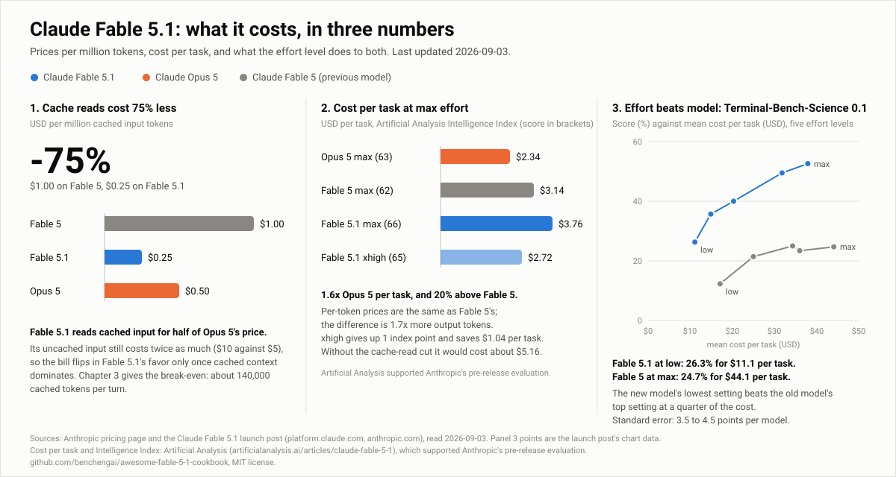
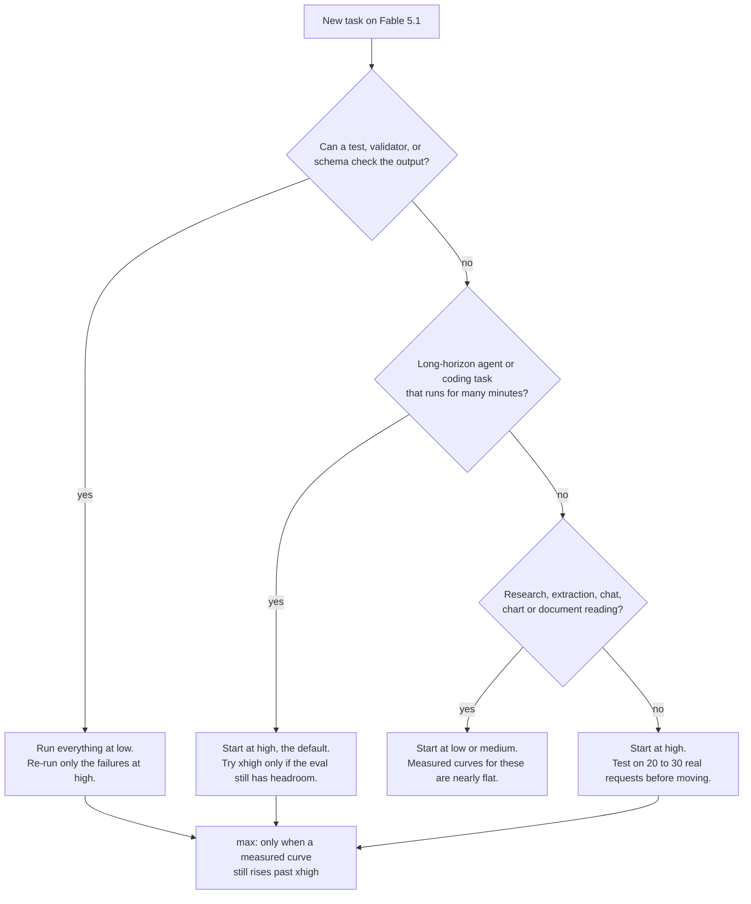

[](CHANGELOG.md)
[](LICENSE)
[](CHANGELOG.md)
[](README.zh-CN.md)

# Awesome Fable 5.1 Cookbook

Fable 5.1 costs twice as much per token and 1.6x as much per task. This guide covers when it is still worth it, and how to cut the bill.

[中文版 README](README.zh-CN.md)



**How to use this guide**

- Just want the answer: read the five rules below, then the decision matrix at the end of chapter 3.
- Want to price your own workload: run `examples/cost_calculator.py` with your token counts.
- Want to check a number: every one has a source, all of them in [`data/facts.json`](data/facts.json).

Numbers come in four grades. **official** is printed on an Anthropic pricing or documentation page. **measured** is a benchmark or cost measurement published by Anthropic or a named third party. **derived** is computed from the first two, with the arithmetic shown. **estimate** has no source and states its assumption. The "source" column in tables and the source line at the end of each section use these words. Prices are USD per million tokens (MTok), verified 2026-09-03. The guide is updated as new models and prices land; see the [changelog](CHANGELOG.md).

**A few terms**

| Term | Meaning |
|---|---|
| token | The billing unit. About four characters of English per token. |
| input / output | What you send is billed as input; what the model writes, including its internal thinking, is billed as output. On Fable 5.1 output costs 5x input. |
| prompt cache | In a multi-turn conversation you resend everything that came before on every turn. The cache lets the model keep what it already processed, so the resend is billed at the low cache-read price. Storing it the first time is a cache write, 25% more than plain input. |
| effort | A request parameter that sets how many tokens the model spends thinking and acting. Five levels, `low` to `max`, each more expensive than the last. |
| cost per solved task | Total spend divided by the number of tasks done correctly. Failed tasks still bill, so a cheap setting that fails often is not cheap by this measure. |
| break-even | The point where two models cost the same per turn. Past it, the model that looked expensive is the cheaper one. |

## Contents

- [TL;DR: five rules](#tldr-five-rules)
- [Fact sheet](#fact-sheet)
- [1. Choosing among the five effort levels](#1-choosing-among-the-five-effort-levels)
- [2. Prompt organization after the 75% cache-read cut](#2-prompt-organization-after-the-75-cache-read-cut)
- [3. Fable 5.1 or Opus 5: where the break-even is](#3-fable-51-or-opus-5-where-the-break-even-is)
- [4. Using the 1M context window](#4-using-the-1m-context-window) (v0.2)
- [5. Migrating from Fable 5](#5-migrating-from-fable-5) (v0.2)
- [6. Common waste patterns checklist](#6-common-waste-patterns-checklist) (v0.2)
- [Update policy and contributing](#update-policy-and-contributing)

## TL;DR: five rules

1. **Start agent loops at `low`, not at the default.** On Anthropic's SWE-bench Pro subset, Fable 5.1 at `low` solved 88.6% of tasks for $0.54 per solved task. The default, `high`, solved 92.1% for $1.19. Raise effort only where the eval misses.
2. **Cache everything that repeats, then check the hit rate.** A Fable 5.1 cache read costs $0.25 per MTok; uncached input costs $10. Caching cut Anthropic's agent-loop costs to between 1/2.7 and 1/5.3. Healthy production loops read 84% of their input from cache. Below 80%, something is breaking the cache.
3. **Fable 5.1 beats Opus 5 on cost only when the cache is most of the bill.** With 2,000 new input and 1,000 output tokens per turn, the two models cost the same at about 140,000 cached tokens per turn. Below that Opus 5 is cheaper. At 600,000 cached tokens Fable 5.1 is 34% cheaper.
4. **A low setting on the new model beats the top setting on the old one.** On Terminal-Bench-Science, Fable 5.1 at `low` scores 26.3% for $11.1 per task. Fable 5 at `max` scores 24.7% for $44.1. Use `max` only when a measured curve still rises past `xhigh`.
5. **Do not cut `max_tokens` to save money.** A 16,384-token cap ended 43% of Fable 5.1's attempts on an internal coding benchmark and saved nothing per solved task ($21 against $22 at 64,000). Save with `effort` and task budgets, which the model can see.

Sources: rules 1 and 5 are Anthropic cost-guide measurements; rule 2 is official pricing plus measurements; rule 3 is derived from official prices; rule 4 is the launch post's chart data.

## Fact sheet

| Item | Claude Fable 5.1 | Source |
|---|---|---|
| API model ID | `claude-fable-5-1` | official |
| Released | 2026-09-01 | official |
| Price, input / output | $10 / $50 per MTok | official |
| Price, cache write 5-minute / 1-hour | $12.50 / $20 per MTok | official |
| Price, cache read | $0.25 per MTok (0.025x input; every other model is 0.1x) | official |
| Price, Batch API | $5 / $25 per MTok, 50% off every token including cache reads and writes | official |
| Context window | 1M tokens, default and maximum, no long-context premium | official |
| Max output | 128K tokens (stream anything above 16K) | official |
| Effort levels | `low`, `medium`, `high` (default), `xhigh`, `max` | official |
| Thinking | Adaptive, always on. `thinking.type: "disabled"` and `budget_tokens` return 400 | official |
| Reliable knowledge cutoff | June 2026 | official |
| Minimum cacheable prefix | 512 tokens | official |
| Retirement | Not sooner than 2027-09-01 | official |
| Data retention | 30-day retention required; zero-data-retention orgs get a 400 | official |
| Cost per Intelligence Index task at `max` | $3.76 (Opus 5: $2.34; Fable 5: $3.14) | measured, Artificial Analysis |
| Launch benchmarks, Fable 5 to 5.1 at `max` | Terminal-Bench-Science 24.7% to 52.6%; Terminal-Bench 4.0 42.0% to 55.8%; CursorBench 70.5% to 73.4%; GDPval-AA 1723 to 1853 Elo | measured, Anthropic launch post |

## 1. Choosing among the five effort levels

Effort sets how many tokens the model spends thinking and acting on each reply. It is the most direct cost control you have. Over the same set of tasks, Artificial Analysis saw Fable 5.1 produce 13.1M output tokens at `low` and 143.7M at `max`, an 11x spread.

### 1.1 What each level is for

Effort applies to all output: text, tool calls, thinking. Lower levels also make fewer and shorter tool calls. `high` is the default and the same as not setting the parameter.

| Level | Anthropic's description | Watch for |
|---|---|---|
| `low` | Simplest tasks that need the best speed and lowest cost, such as subagents | Fable 5.1 at `low` answers from memory more often and calls search tools less; add a "check before answering" line for turns that need fresh data |
| `medium` | Agentic tasks that need a balance of speed, cost, and performance | The step down once an eval shows quality holds |
| `high` | Complex reasoning, difficult coding, agentic tasks. The default | Set a large `max_tokens`; it caps thinking plus text |
| `xhigh` | Long-running agentic and coding tasks, over 30 minutes, with token budgets in the millions | Noticeably more tokens than `high` |
| `max` | Deepest possible reasoning, no limit on token spending | On most tasks the extra money buys little; structured tasks can overthink |

Source: Anthropic effort documentation (official).

### 1.2 What the levels cost, measured

The launch post has a chart with every level on four benchmarks. The numbers below are read from that chart's data: mean cost per task in USD, and the score.

| Effort | Terminal-Bench-Science 0.1 | Terminal-Bench 4.0 | CursorBench 3.2.0 | Humanity's Last Exam, with tools |
|---|---|---|---|---|
| `low` | 26.3% for $11.1 | 40.2% for $5.7 | 66.2 for $2.90 | 60.0 for $0.52 |
| `medium` | 35.7% for $14.9 | 43.4% for $7.8 | 68.0 for $3.53 | 63.0 for $0.67 |
| `high` | 40.0% for $20.3 | 49.4% for $10.5 | 69.4 for $4.80 | 64.8 for $1.05 |
| `xhigh` | 49.5% for $31.8 | 51.3% for $15.8 | 72.8 for $6.96 | 65.1 for $2.28 |
| `max` | 52.6% for $37.9 | 55.8% for $19.5 | 73.4 for $9.64 | 65.0 for $3.20 |

Three things to take from the table:

- From `low` to `max` the cost goes up 3 to 3.5x, and 6x on Humanity's Last Exam.
- What that buys varies a lot. Terminal-Bench-Science gains 26 points, Terminal-Bench 4.0 gains 16, CursorBench only 7, Humanity's Last Exam only 5, and that one stops moving at `high`: `max` scores 0.1 below `xhigh` and costs 40% more.
- Terminal-Bench-Science has an error bar of 3.5 to 4.5 points per model. Neighboring levels are mostly inside it. `low` to `max` is not.

Anthropic's cost guide shows the same shape. On DeepResearch Bench II, Fable 5.1 scored about the same at `low`, `medium`, and `high` while cost per task rose from $4.66 to $7.12. On four research benchmarks with Fable 5, `low` gave up 1 to 3 points and saved a third to a half, and `medium` matched the default's score for 70% to 87% of the money. The exception is long-horizon coding: on SWE-bench Pro, Opus 5 gave up about 2 points at `medium` for half the cost and about 8 points at `low` for a quarter. There, effort really buys score.

Sources: launch post chart data and Anthropic cost guide (measured); multipliers derived.

### 1.3 Decision tree



### 1.4 Scenario table

| Scenario | Start at | Evidence |
|---|---|---|
| Subagent doing a scoped lookup or a bulk read | `low` | Anthropic names subagents as the `low` use case; lower effort makes fewer, shorter tool calls |
| Classification, extraction, tagging with a schema | `low` with `strict: true` tools or structured outputs | Research and knowledge-work curves are nearly flat: `low` saves a third to a half for 1 to 3 points (Fable 5 measurements) |
| Latency-sensitive chat | `low` | On DeepWideSearch, `low` took 4.5 minutes per problem against 7.9 at the default (Fable 5 measurements) |
| Chart or document reading | `low` | Chartography: Fable 5.1 at `low` scored 62.5 for $0.15 per chart; Opus 5 at `low` scored 49 for $0.38 |
| Deep research report | `low` | DeepResearch Bench II: `low` 66% for $4.66, `high` 65% for $7.12 |
| Coding with tests that can grade the result | `low`, re-run failures at `high` | Opus 5 on SWE-bench Pro: about 93% pass for about $0.45 per task, against 91.7% for $0.93 at the default throughout |
| Coding without an automatic check | `high` | SWE-bench Pro: Fable 5.1 default 92.1% for $1.19 against `low` 88.6% for $0.54; those 3.5 points cost 2.2x |
| Long agent loop, over 30 minutes | `high`, then `xhigh` if the eval has headroom | Terminal-Bench 4.0: `high` 49.4% for $10.5, `xhigh` 51.3% for $15.8, `max` 55.8% for $19.5 |
| Agentic scientific work where every point counts | `xhigh` or `max` | Terminal-Bench-Science: `xhigh` 49.5% for $31.8, `max` 52.6% for $37.9, 3.1 points for 19% more |
| Multi-file refactor or migration across sessions | `high` | Anthropic says the Fable 5 to 5.1 gains concentrate in long agentic coding and grow with effort |
| Eval judge or grader | `low` or `medium` | Structured, checkable output; the research curves above apply |
| Any prompt that will run 10,000 times | Sweep first | Anthropic's protocol: 20 to 30 real requests, one level per pass, cost per completed task beside the score |

Sources: the numbers in the evidence column are Anthropic cost-guide and launch-post measurements; rows 1, 2, 10, and 12 quote official documentation.

### 1.5 The counter-intuitive result: `low` on the new model beats `max` on the old one

On Terminal-Bench-Science, Fable 5.1 at `low` scores 26.3% for $11.1 per task. Fable 5 at `max` scores 24.7% for $44.1. The score gap, 1.6 points, is inside the error bar. The cost gap, 4x, is not.

One tier down, same thing. Opus 5 at `low` beats Opus 4.8 at its default on SWE-bench Pro for about 30% of the cost per solved task. Fable 5.1 matches Fable 5's SWE-bench Pro score for 43% less per solved task, most of it the cheaper cache reads. So the cheapest upgrade is usually the new model at a lower setting, not the old model at a higher one.

It is not a law. On DeepResearch Bench II the Fable 5 to 5.1 upgrade costs 41% more per task at `high` and 79% more at `low`, for 2 to 3 extra points, because the new model runs longer and reads more on that kind of task. Measure the upgrade on your own tasks first.

Sources: launch post chart data and Anthropic cost guide (measured); 11.1 / 44.1 = 0.25 derived.

### 1.6 Run at `low`, re-run failures at `high`

When a task's result can be checked automatically, the cheapest policy is not a fixed level. Anthropic worked it out task by task with Opus 5 on SWE-bench Pro:

| Policy | Pass rate | Cost per task |
|---|---|---|
| Everything at the default (`high`) | 91.7% | $0.93 |
| Everything at `low`, failures re-run at the default | about 93% | about $0.45 |
| Everything at `medium`, failures re-run at the default | about 94% | about $0.61 |

The $0.45 already includes the failed cheap attempts. Use this to save money, not to gain points: re-running the default's own failures at the default scores about the same for more money. Budget for the checker, and for the 16% of tasks that fail the first pass and run twice.

Source: Anthropic cost guide (measured).

### 1.7 Changing effort inside a conversation

Changing the top-level `effort` between requests invalidates the prompt cache from that point. On Fable 5.1 it also steers less well, because the model's earlier replies were written at the old level. Anthropic measured the cache cost on a triage agent: a session with no mid-session changes cost $0.81; the same session with an effort change and an added tool cost $0.95, because the two changes rewrote 39,000 and 60,000 cached tokens.

Fable 5.1 and Opus 5 support a per-message effort change that keeps the cache. Add a `system` message with empty content and the new level; it takes effect from the next user turn. It needs the beta header `mid-conversation-output-config-2026-07-01`. Fable 5 returns a 400 for it.

```python
import anthropic

client = anthropic.Anthropic()

response = client.beta.messages.create(
    model="claude-fable-5-1",
    max_tokens=16000,
    output_config={"effort": "high"},
    messages=[
        {"role": "user", "content": "Plan the migration in three steps."},
        {"role": "assistant", "content": "1. Export. 2. Create the schema. 3. Import and verify row counts."},
        # Effort-only system message: applies from the next user turn, cache stays warm.
        {"role": "system", "content": [], "output_config": {"effort": "low"}},
        {"role": "user", "content": "Summarize the plan in one sentence."},
    ],
    betas=["mid-conversation-output-config-2026-07-01"],
)
```

Sources: Anthropic effort documentation (official), cost guide (measured).

### 1.8 Three knobs that are not effort

- **`max_tokens` is a safety cap the model cannot see.** At a 16,384 cap, 15% of Opus 5's attempts and 43% of Fable 5.1's were cut off on an internal repository benchmark, and only 9 of the 117 capped Fable attempts still passed. Cost per solved task was about the same as at 64,000, $21 against $22, because capped tasks mostly fail. At 64,000 Fable 5.1 solved 58.5% instead of 36.3%; at 128,000, 60.0%. So set 64,000 for agentic work, 128,000 at `xhigh` or `max`, stream the response, and treat `stop_reason: "max_tokens"` as a failure.
- **Task budgets are the budget that saves money.** The model sees the countdown and paces itself. On SWE-bench Pro, a generous budget cut Fable 5.1's cost per task 44% for about 3 points of pass rate; the tightest allowed budget cut it 58% for 6 points. Beta header `task-budgets-2026-03-13`, minimum 20,000 tokens, set once on the first request.
- **Ask for the answer you will actually read.** On a triage agent a one-line answer cost $0.49 per run, the two-line original $0.57, and a memo $1.40, six times the output tokens. All three scored 78% to 85% correct, no real difference.

Source: Anthropic cost guide (measured).

## 2. Prompt organization after the 75% cache-read cut

In an agent loop the biggest line is usually cache reads: a healthy loop reads 84% of its input from cache. Fable 5.1 cut that line's price from $1.00 to $0.25. This chapter is about getting that 84% and not letting it quietly fall to zero.

### 2.1 The prices that matter

| Operation | Fable 5.1 | Fable 5 | Opus 5 | Multiplier of base input |
|---|---|---|---|---|
| Uncached input | $10.00 | $10.00 | $5.00 | 1x |
| Cache write, 5-minute TTL | $12.50 | $12.50 | $6.25 | 1.25x |
| Cache write, 1-hour TTL | $20.00 | $20.00 | $10.00 | 2x |
| Cache read (hit or refresh) | $0.25 | $1.00 | $0.50 | 0.025x on Fable 5.1, 0.1x elsewhere |
| Output | $50.00 | $50.00 | $25.00 | |
| Batch API | 50% off every row above, cache reads and writes included | same | same | |

Source: Anthropic pricing page (official). TTL is how long a cache entry lives.

### 2.2 What the cut changes

- **One read pays back the write.** A 5-minute entry costs 1.25x to write and 0.025x to read, 1.275x in total; sending the prefix twice uncached costs 2x. A 1-hour entry costs 2x to write and needs two reads to pay back.
- **The whole bill moves.** Fable 5.1 matches Fable 5's SWE-bench Pro score for 43% less per solved task, and cache reads are most of that saving. Anthropic's launch chart puts a typical workload at 75 and a highly agentic one at 55, with Fable 5 at 100. Artificial Analysis puts the saving at about $1.40 per Intelligence Index task, from about $5.16 to $3.76.
- **Cache reads were most of the old bill.** Reading that launch chart backwards, cache reads were about 44% of a typical Fable 5 workload's cost and about 68% of a highly agentic one's.
- **Misses hurt more now.** An uncached token now costs 40 cached ones, up from 10. Every cache breaker in section 2.6 does four times the damage it did on Fable 5.

Sources: pricing page (official), cost guide and launch post (measured), Artificial Analysis (measured); payback and multipliers derived.

### 2.3 A worked loop

`examples/cost_calculator.py` prices a loop that resends its whole history every turn: a 20,000-token prefix (system prompt, tools, reference material), 40 turns, 2,000 new input tokens (the tool result) and 1,000 output tokens per turn. It sends 3,220,000 input tokens over the run.

| Model | Caching | Uncached input | Cache write | Cache read | Output | Total |
|---|---|---|---|---|---|---|
| Fable 5.1 | no | $32.20 | | | $2.00 | $34.20 |
| Fable 5.1 | yes | | $1.74 | $0.77 | $2.00 | $4.51 |
| Opus 5 | no | $16.10 | | | $1.00 | $17.10 |
| Opus 5 | yes | | $0.87 | $1.54 | $1.00 | $3.41 |
| Sonnet 5 | no | $6.44 | | | $0.40 | $6.84 |
| Sonnet 5 | yes | | $0.35 | $0.62 | $0.40 | $1.36 |

Two things to notice. Caching cuts this loop to 1/7.6 on Fable 5.1; Anthropic measured 1/2.7 to 1/5.3 on real benchmarks, where tool results and outputs are larger. And once caching is on, the biggest line on Fable 5.1 is output ($2.00 of $4.51) while on Opus 5 it is cache reads ($1.54 of $3.41). That is why effort matters more on Fable 5.1, and why the two models cross over in chapter 3.

```bash
python examples/cost_calculator.py loop --prefix 20000 --turns 40 --new-input 2000 --output 1000
```

Source: derived from official prices; assumptions are in the script.

### 2.4 Layout rules

The cache is a byte-exact prefix match over the request in order: `tools`, then `system`, then `messages`. Change one byte and everything after it is lost.

1. **Stable content first, changing content last.** Frozen system prompt, tool list in a fixed order, reference documents; then the conversation; then whatever differs per request, such as retrieved rows, the question, anything with a timestamp.
2. **One explicit breakpoint at the end of the static prefix, plus automatic caching for the tail.** The explicit marker guarantees the expensive shared part can always be read back; the top-level `cache_control` field moves a breakpoint forward as the conversation grows. This is the robust shape for agent loops.
3. **Three hard limits.** A prefix under 512 tokens does not cache, and nothing warns you. At most 4 breakpoints per request. The system looks back 20 blocks from each breakpoint, so a turn that appends many blocks needs a second breakpoint.
4. **Many conversations sharing one prefix need the explicit marker.** Automatic caching only works within one conversation. A queue of independent tasks with the same system prompt reads it back only if that shared part has its own breakpoint.

```python
import anthropic

client = anthropic.Anthropic()

with client.messages.stream(
    model="claude-fable-5-1",
    max_tokens=64000,
    output_config={"effort": "low"},
    tools=TOOLS,  # same list, same order, on every request
    system=[
        {"type": "text", "text": SYSTEM_PROMPT},
        {"type": "text", "text": REFERENCE_DOCS, "cache_control": {"type": "ephemeral"}},
    ],
    messages=history + [{"role": "user", "content": new_tool_result_or_question}],
    cache_control={"type": "ephemeral"},  # automatic breakpoint that follows the tail
) as stream:
    response = stream.get_final_message()

u = response.usage
print(u.cache_read_input_tokens, u.cache_creation_input_tokens, u.input_tokens)
```

Source: Anthropic prompt caching documentation (official).

### 2.5 TTL and keep-alive

The cache lifetime counts from the start of the request that wrote or read the entry, and generation time counts against it. After a 4-minute response, the next request has about 1 minute to start before a 5-minute entry expires.

| Gap between requests sharing the prefix | Fable 5.1 choice | Why |
|---|---|---|
| Under 5 minutes (continuous loops) | 5-minute TTL | Every request refreshes it. With no pauses, the 5-minute default cost 15% less than the 1-hour TTL on Sonnet 5 and 11% less on Opus 5 |
| Minutes to tens of minutes (a person replies later, a long generation) | 5-minute TTL plus a keep-alive | Resend the previous request with `max_tokens: 0` and `stream` off within 4 minutes of the previous request's start, and every 4 minutes after. It bills one cheap cache read and restarts the clock. Anthropic measured it cheaper than the 1-hour TTL on Fable 5.1 while pauses run minutes |
| Pauses approaching an hour | 1-hour TTL | Once keep-alives would run most of an hour, the 1-hour write premium is the smaller bill |
| Over an hour | Neither. Accept the miss, or re-warm on a schedule | |

The keep-alive arithmetic is short. On a 200,000-token prefix, one keep-alive read costs 200,000 x $0.25 / 1M = $0.05. The 1-hour TTL adds $7.50 per MTok to every write, $1.50 for that prefix. Fifteen keep-alives cover an hour for $0.75. Keep-alives cannot be used with structured outputs or through the Batch API; use the 1-hour TTL there.

Sources: prompt caching documentation (official), cost guide (measured); keep-alive arithmetic derived.

### 2.6 Silent cache breakers

Each of these sets `cache_read_input_tokens` to 0 with no error:

- A timestamp, date, request ID, or user name in the system prompt or anywhere before the breakpoint
- A tool list that changes, or is serialized in a different order, between requests
- Unsorted JSON or dictionaries rendered into the prefix
- Changing the top-level `effort` or thinking configuration between requests (use the per-message form in section 1.7)
- Switching models mid-conversation: caches are per model and per workspace
- Changing a task budget after the first request
- Every context-editing pass, which rewrites the prefix from the point it clears
- A prefix under 512 tokens
- Per-request content placed above the static block instead of below it

What one breaker costs: on the triage agent, one mid-session effort change plus one added tool moved the session from $0.81 to $0.95. The same changes made on the first request after compaction cost $0.75, because that request was being rewritten anyway.

Sources: prompt caching documentation (official), cost guide (measured).

### 2.7 Verify from `usage`, not from reading the code

In a healthy, warmed-up loop, `cache_read_input_tokens` is far above `input_tokens`, and `cache_creation_input_tokens` is about one turn's worth, not the whole conversation. Healthy production loops read 84% of input from cache, the best 10% read 94% or more, and below about 80% you should look for a breaker. The cheapest test is a probe: send one representative request twice, byte-identical, and fail the build if the second response's `cache_read_input_tokens` is zero.

Source: cost guide (measured).

### 2.8 Batch stacks with caching

The Batch API takes 50% off every token, cache reads and writes included. A cached read on Fable 5.1 through batch costs $0.125 per MTok; batch input and output are $5 and $25. Results arrive within 24 hours and requests are single-shot, so it fits evaluation runs, backfills, and scheduled jobs, not anything a person is waiting on. On DeepResearch Bench II, caching alone took Fable 5.1 from $37.94 to $7.12 per task; batch would halve that again for offline runs.

Sources: pricing page (official), cost guide (measured); $0.125 derived.

## 3. Fable 5.1 or Opus 5: where the break-even is

The model is the largest single line on the bill. Anthropic's own documentation points two ways, and the price table explains why both are right.

### 3.1 Two official positions

- The models overview: start with Claude Opus 5 for most workloads; use Fable 5.1 for demanding reasoning and long-horizon agentic work, or when evals on Opus 5 at higher effort still fall short.
- The cost guide: "For most agent workloads, start with Claude Fable 5.1 at `low` effort and raise effort where it misses. Per token it costs twice what Claude Opus 5 does on uncached input, but half as much on cached input ($0.25 against $0.50 per million), and in an agent loop cached input is the largest term."

The first is about capability and applies to everything. The second is about one bill shape: a loop that re-reads a large cached prefix every turn. Section 3.3 gives the number that separates them.

Sources: Anthropic models overview and cost guide (official).

### 3.2 Price table

| Per MTok | Fable 5.1 | Opus 5 | Fable 5.1 / Opus 5 |
|---|---|---|---|
| Input, uncached | $10.00 | $5.00 | 2x |
| Output | $50.00 | $25.00 | 2x |
| Cache write, 5-minute | $12.50 | $6.25 | 2x |
| Cache write, 1-hour | $20.00 | $10.00 | 2x |
| Cache read | $0.25 | $0.50 | 0.5x |
| Batch input / output | $5 / $25 | $2.50 / $12.50 | 2x |

Source: Anthropic pricing page (official).

### 3.3 The cache-read inversion

Only one row in that table favors Fable 5.1: cache reads. And in a long loop, cache reads are most of the tokens. So as the cache grows, Fable 5.1 goes from the expensive model to the cheap one.

Per turn, with 2,000 new input tokens and 1,000 output tokens on top of C cached tokens (C in millions), at list prices:

- Fable 5.1: 0.25 x C + 2,000 x $10 / 1M + 1,000 x $50 / 1M = 0.25C + $0.070
- Opus 5: 0.50 x C + 2,000 x $5 / 1M + 1,000 x $25 / 1M = 0.50C + $0.035
- Equal at C = 0.035 / 0.25 = 0.14M, about **140,000 cached tokens per turn**

| Cached tokens per turn | Fable 5.1 per turn | Opus 5 per turn | Fable 5.1 relative to Opus 5 |
|---|---|---|---|
| 0 | $0.070 | $0.035 | +100% |
| 50,000 | $0.083 | $0.060 | +38% |
| 100,000 | $0.095 | $0.085 | +12% |
| 140,000 | $0.105 | $0.105 | 0% |
| 200,000 | $0.120 | $0.135 | -11% |
| 300,000 | $0.145 | $0.185 | -22% |
| 600,000 | $0.220 | $0.335 | -34% |
| 1,000,000 | $0.320 | $0.535 | -40% |

Three assumptions, all of them kind to Fable 5.1: every cached token is a hit; the new tokens are billed as plain input rather than written to the cache; both models produce the same amount of output. Writing the new tokens to the 5-minute cache moves the break-even to about 175,000. And Fable 5.1 tends to do more per task: on the Intelligence Index it produced 1.7x Fable 5's output tokens, and on DeepResearch Bench II its default cost more than Opus 5's default for a lower score. So treat 140,000 as the point where Fable 5.1 can start to win, not as a guarantee.

The break-even framing follows Digital Applied's analysis; the arithmetic here is redone from Anthropic's list prices, in the script.

```bash
python examples/cost_calculator.py breakeven --new-input 2000 --output 1000
```

Sources: derived from official prices; the output multiplier and DeepResearch numbers are Artificial Analysis and cost-guide measurements.

### 3.4 Cost per task, whole-suite average

Artificial Analysis runs its whole Intelligence Index and averages the cost per task. Note that Artificial Analysis supported Anthropic's pre-release evaluation of this model.

| Model and effort | Intelligence Index | Cost per task |
|---|---|---|
| Opus 5, `max` | 63 | $2.34 |
| Fable 5, `max` | 62 | $3.14 |
| Fable 5.1, `xhigh` | 65 | $2.72 |
| Fable 5.1, `max` | 66 | $3.76 |

Fable 5.1 at `max` costs 1.6x Opus 5 (3.76 / 2.34 = 1.61) and 20% more than Fable 5 (3.76 / 3.14 = 1.20). Its per-token prices are the same as Fable 5's; the extra cost is 1.7x the output tokens. One step down to `xhigh` gives up 1 index point and saves $1.04 per task. Some secondary sources quote $3.69 and "57% more than Opus 5"; this guide uses the Artificial Analysis article's own $3.76.

Source: Artificial Analysis (measured); ratios derived.

### 3.5 Cost per solved task, benchmark by benchmark

Price lists charge per token; you pay for finished tasks. Anthropic priced its runs the way a customer is billed:

| Benchmark | Fable 5.1 | Opus 5 | Who wins on cost per result |
|---|---|---|---|
| SWE-bench Pro subset, cost per solved task | `low` 88.6% for $0.54; default 92.1% for $1.19 | `low` 84.0% for $0.25; default 91.7% for $1.01 | For the top score, Opus 5 at the default, 15% cheaper. For 88%, Fable 5.1 at `low` |
| Internal agentic-coding benchmark, cost per attempt | `medium` $2.91 | default $8.50, same score | Fable 5.1 at `medium`, about a third of the money |
| DeepResearch Bench II, cost per task | `low` 66% for $4.66; default 65% for $7.12 | default 71% for $6.71 | For the top score, Opus 5 at the default. Fable 5.1 only pays off at `low` |
| Chartography, cost per chart | `low` 62.5 for $0.15 | `low` 49 for $0.38 | Fable 5.1, higher score for 40% of the price |
| Terminal-Bench-Science, cost per task | `low` 26.3% for $11.1; `max` 52.6% for $37.9 | not published | Only comparable with Fable 5 |

The formula behind the table: cost per success = cost per attempt / pass rate. It is hard on settings that are cheap but fail often, because a failed attempt still bills, the retry bills again, and the failure has its own downstream cost. And watch the tail, not the median: on 20 WideSearch problems, the two most expensive carried 43% of the spend and the cheapest half only 10%.

Source: Anthropic cost guide (measured).

### 3.6 Decision matrix

| Workload | Pick | Numbers |
|---|---|---|
| Requests with little shared context, any volume | Opus 5 | Below 140,000 cached tokens per turn Opus 5 is cheaper, by up to half at zero cache |
| Coding agent with tests | Fable 5.1 at `low`, or Opus 5 at `low` with failures re-run at `high` | Fable 5.1 `low` 88.6% for $0.54; Opus 5 re-run policy about 93% for about $0.45 |
| Coding agent without tests, top score required | Opus 5 at the default | 91.7% for $1.01 against Fable 5.1's 92.1% for $1.19, a gap inside the noise |
| Long loop over a large fixed context (200,000 cached tokens or more per turn) | Fable 5.1, start at `low` | At 300,000 cached tokens per turn Fable 5.1 is 22% cheaper, at 600,000 34%; also the cost guide's own advice |
| Deep research reports | Opus 5 at the default, or Fable 5.1 at `low` on a tighter budget | 71% for $6.71 against 66% for $4.66 |
| Chart and document reading | Fable 5.1 at `low` | 62.5 for $0.15 against Opus 5's 49 for $0.38 |
| Work where Opus 5 at `xhigh` or `max` still misses | Fable 5.1 at `xhigh` or `max` | The official upgrade trigger; Intelligence Index 66 against 63 |
| High-volume simple tasks with a checker | Haiku 4.5 or Sonnet 5 | Haiku 4.5 answered GPQA Diamond at about a tenth of Opus 5's cost per question, 63% against 92% |

Sources: rows 1 and 4 derived from official prices; the rest are cost-guide and Artificial Analysis measurements.

### 3.7 Subscribers

Claude Pro subscribers pay extra to use Fable 5.1; Opus 5 is the strongest model included in the subscription. This is currently an estimate: reported by the maintainer, source link pending; it will be regraded once the support article is linked.

### 3.8 What changes the answer

- **Retries and review.** If a failed task costs a human review, add that to the cost per attempt before dividing by the pass rate. At $1 per attempt, a 4-point pass-rate gap is worth $0.18; at $5 per review it is worth far more.
- **Refusals and fallback.** Fable 5.1 runs safety classifiers and can return `stop_reason: "refusal"`. Server-side fallback retries on Opus 5 or Opus 4.8, and fallback credit refunds the cache cost of switching. A workload that trips refusals often pays for two models.
- **Rate limits and tiers.** Fable 5.1 shares a rate-limit pool with Fable 5 and has no Priority Tier. Fast mode exists only for Opus 5 and Opus 4.8, at $10 / $50.
- **Data retention.** Fable 5.1 requires 30-day retention; zero-data-retention organizations get a 400 on every request.
- **US-only inference** multiplies every token by 1.1 on either model.

Sources: Anthropic pricing page and Fable 5.1 documentation (official); the review example is derived.

## 4. Using the 1M context window

Planned for v0.2 (target 2026-09-05). Two numbers to hold until then: the 1M window carries no long-context premium, and filling it once costs $10.00 as uncached input, $12.50 as a 5-minute cache write, and $0.25 as a cache read.

## 5. Migrating from Fable 5

Planned for v0.2 (target 2026-09-06). The three breaking changes are already in [`data/facts.json`](data/facts.json): forced `tool_choice` returns 400, thinking blocks are bound to the producing model, and editing earlier turns invalidates thinking blocks for accounts created on or after 2026-08-31.

## 6. Common waste patterns checklist

Planned for v0.2 (target 2026-09-07). Each item will carry a measured cost and the `usage` field that exposes it.

## Update policy and contributing

- New Anthropic model launches and price changes are folded in as they land. `data/facts.json` changes first, then both READMEs and the infographic, then the [changelog](CHANGELOG.md) and the badge date.
- A contributed number needs a source URL, the date it was checked, and a grade. Pull requests without all three are not merged.
- Disagreements between sources are recorded under `discrepancies` in `data/facts.json` with the canonical choice and the reason.
- Superseded advice is dated, not deleted.

## Sources

- Anthropic pricing: https://platform.claude.com/docs/en/about-claude/pricing
- Anthropic models overview: https://platform.claude.com/docs/en/about-claude/models/overview
- Claude Fable 5.1 model page and what's new: https://platform.claude.com/docs/en/models/fable-5-1/overview
- Effort: https://platform.claude.com/docs/en/build-with-claude/effort
- Prompt caching: https://platform.claude.com/docs/en/build-with-claude/prompt-caching
- Optimizing for cost and intelligence (all Anthropic measurements above): https://platform.claude.com/docs/en/about-claude/models/optimizing-for-cost-and-intelligence
- Launch post, including the per-effort chart data: https://www.anthropic.com/claude-fable-and-mythos-5-1
- Artificial Analysis: https://artificialanalysis.ai/articles/claude-fable-5-1

## License

MIT, copyright 2026 Ben Cheng. See [LICENSE](LICENSE).
