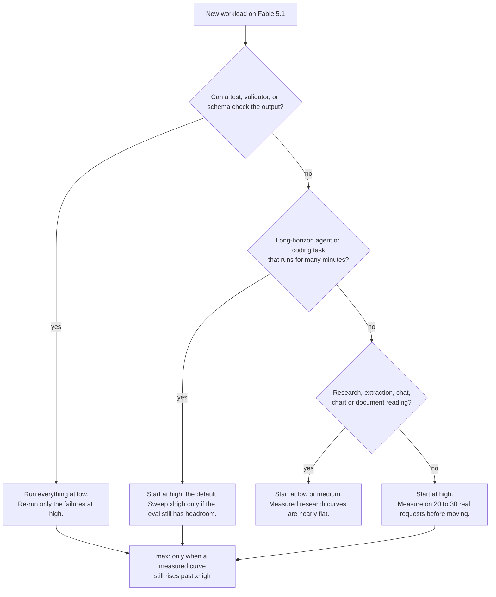

[](CHANGELOG.md)
[](LICENSE)
[](CHANGELOG.md)
[](README.zh-CN.md)

# Awesome Fable 5.1 Cookbook

Fable 5.1 costs twice as much per token and 1.6x as much per task. This guide covers when it is still worth it, and how to cut the bill.

[中文版 README](README.zh-CN.md)


This guide is continuously updated. New model releases and price changes are folded in as they land; see the [changelog](CHANGELOG.md). Every number carries a grade: **official** (an Anthropic pricing or documentation page), **measured** (a benchmark or cost measurement published by Anthropic or a named third party), **derived** (computed from the first two, with the arithmetic shown), or **estimate** (stated assumption, no source). All numbers, sources, and formulas live in [`data/facts.json`](data/facts.json). Prices are USD per million tokens (MTok) unless stated otherwise, verified 2026-09-03.

## Contents

- [TL;DR: five rules](#tldr-five-rules)
- [Fact sheet](#fact-sheet)
- [1. Choosing among the five effort levels](#1-choosing-among-the-five-effort-levels)
- [2. Prompt organization after the 75% cache-read cut](#2-prompt-organization-after-the-75-cache-read-cut)
- [3. Fable 5.1 or Opus 5: where the break-even is](#3-fable-51-or-opus-5-where-the-break-even-is)
- [4. Using the 1M context window](#4-using-the-1m-context-window) (v0.2)
- [5. Migrating from Fable 5](#5-migrating-from-fable-5) (v0.2)
- [6. Common waste patterns checklist](#6-common-waste-patterns-checklist) (v0.2)
- [Update policy and contributing](#update-policy-and-contributing)

## TL;DR: five rules

1. **Start agent loops at `low`, not at the default.** On Anthropic's SWE-bench Pro subset, Fable 5.1 at `low` solved 88.6% of tasks for $0.54 per solved task; the default (`high`) solved 92.1% for $1.19. Raise effort where the eval misses. (measured)
2. **Cache everything that repeats, then verify the hit rate.** A Fable 5.1 cache read costs $0.25 per MTok against $10 uncached. Caching cut Anthropic's agent-loop costs by 2.7x to 5.3x; production loops read a median 84% of their input from cache. Below 80%, something is breaking the cache. (official, measured)
3. **Fable 5.1 beats Opus 5 on cost only when cached context dominates.** With 2,000 new input and 1,000 output tokens per turn, the two models cost the same at about 140,000 cached tokens per turn. Below that Opus 5 is cheaper per turn; at 600,000 cached tokens Fable 5.1 is 34% cheaper. (derived)
4. **A lower effort on the new model beats the top effort on the old one.** On Terminal-Bench-Science, Fable 5.1 at `low` scores 26.3% for $11.1 per task; Fable 5 at `max` scores 24.7% for $44.1. Use `max` only when a measured curve still rises past `xhigh`. (measured)
5. **Do not lower `max_tokens` to save money.** A 16,384-token cap ended 43% of Fable 5.1's attempts on an internal coding benchmark and left cost per solved task unchanged ($21 against $22 at 64,000). Save with `effort` and task budgets, which the model can see. (measured)

## Fact sheet

| Item | Claude Fable 5.1 | Source |
|---|---|---|
| API model ID | `claude-fable-5-1` | official |
| Released | 2026-09-01 | official |
| Price, input / output | $10 / $50 per MTok | official |
| Price, cache write 5-minute / 1-hour | $12.50 / $20 per MTok | official |
| Price, cache read | $0.25 per MTok (0.025x input; every other model is 0.1x) | official |
| Price, Batch API | $5 / $25 per MTok, 50% off every token including cache reads and writes | official |
| Context window | 1M tokens, default and maximum, no long-context premium | official |
| Max output | 128K tokens (stream anything above 16K) | official |
| Effort levels | `low`, `medium`, `high` (default), `xhigh`, `max` | official |
| Thinking | Adaptive, always on. `thinking.type: "disabled"` and `budget_tokens` return 400 | official |
| Reliable knowledge cutoff | June 2026 | official |
| Minimum cacheable prefix | 512 tokens | official |
| Retirement | Not sooner than 2027-09-01 | official |
| Data retention | 30-day retention required; zero-data-retention orgs get a 400 | official |
| Cost per Intelligence Index task at `max` | $3.76 (Opus 5: $2.34; Fable 5: $3.14) | measured, Artificial Analysis |
| Launch benchmarks, Fable 5 to 5.1 at `max` | Terminal-Bench-Science 24.7% to 52.6%; Terminal-Bench 4.0 42.0% to 55.8%; CursorBench 70.5% to 73.4%; GDPval-AA 1723 to 1853 Elo | measured, Anthropic launch post |

## 1. Choosing among the five effort levels

This chapter cuts the largest line you control directly: output tokens, which effort scales. Over the Artificial Analysis Intelligence Index run, Fable 5.1 produced 13.1M output tokens at `low` and 143.7M at `max`, an 11x spread on the same tasks (measured).

### 1.1 What each level is for

Effort applies to every output token: visible text, tool calls and their arguments, and thinking. Lower levels also make fewer and terser tool calls. `high` is the default and identical to omitting the parameter (official).

| Level | Anthropic's description | Watch for |
|---|---|---|
| `low` | Simplest tasks that need the best speed and lowest cost, such as subagents | Fable 5.1 at `low` answers from memory more often and calls search tools less; add a verification instruction for turns that need fresh data |
| `medium` | Agentic tasks that need a balance of speed, cost, and performance | The cost-control step-down once an eval shows quality holds |
| `high` | Complex reasoning, difficult coding, agentic tasks. The default | Set a large `max_tokens`; it caps thinking plus text |
| `xhigh` | Long-running agentic and coding tasks, over 30 minutes, with token budgets in the millions | Meaningfully more tokens than `high` |
| `max` | Deepest possible reasoning, no constraint on token spending | On most workloads adds cost for small gains; can overthink structured tasks |

Source: Anthropic effort documentation (official).

### 1.2 What the levels cost, measured

The launch post charts every level on four benchmarks. The points below are read from that chart data: mean cost per task in USD and score (measured).

| Effort | Terminal-Bench-Science 0.1 | Terminal-Bench 4.0 | CursorBench 3.2.0 | Humanity's Last Exam, with tools |
|---|---|---|---|---|
| `low` | 26.3% for $11.1 | 40.2% for $5.7 | 66.2 for $2.90 | 60.0 for $0.52 |
| `medium` | 35.7% for $14.9 | 43.4% for $7.8 | 68.0 for $3.53 | 63.0 for $0.67 |
| `high` | 40.0% for $20.3 | 49.4% for $10.5 | 69.4 for $4.80 | 64.8 for $1.05 |
| `xhigh` | 49.5% for $31.8 | 51.3% for $15.8 | 72.8 for $6.96 | 65.1 for $2.28 |
| `max` | 52.6% for $37.9 | 55.8% for $19.5 | 73.4 for $9.64 | 65.0 for $3.20 |

How to read it (derived from the table above):

- Going from `low` to `max` multiplies cost by 3.4x on Terminal-Bench-Science, 3.4x on Terminal-Bench 4.0, 3.3x on CursorBench, and 6.2x on Humanity's Last Exam.
- The score it buys differs by an order of magnitude: 26 points on Terminal-Bench-Science, 16 on Terminal-Bench 4.0, 7 on CursorBench, 5 on Humanity's Last Exam, where everything above `high` is flat and `max` scores 0.1 below `xhigh` for 40% more money.
- On Terminal-Bench-Science the standard error is 3.5 to 4.5 points per model, so single steps below `xhigh` are inside the noise; the `low` to `max` gap is not.

The same shape appears in Anthropic's cost guide (measured): on DeepResearch Bench II, Fable 5.1 scored nearly the same at `low`, `medium`, and `high` while cost per task rose from $4.66 to $7.12. On four research benchmarks with Fable 5, `low` gave up 1 to 3 points for a third to a half off the cost per task, and `medium` matched the default's accuracy at 70% to 87% of its cost. Long-horizon coding is the exception: on SWE-bench Pro, Opus 5 gave up about 2 points at `medium` for half the cost and about 8 points at `low` for a quarter.

### 1.3 Decision tree



### 1.4 Scenario table

| Scenario | Start at | Evidence |
|---|---|---|
| Subagent doing a scoped lookup or a bulk read | `low` | Anthropic names subagents as the `low` use case; lower effort makes fewer, terser tool calls (official) |
| Classification, extraction, tagging with a schema | `low` with `strict: true` tools or structured outputs | Research and knowledge-work curves are nearly flat: `low` costs a third to a half less for 1 to 3 points (measured, Fable 5) |
| Latency-sensitive chat | `low` | On DeepWideSearch, `low` took 4.5 minutes per problem against 7.9 at the default (measured, Fable 5) |
| Chart or document reading | `low` | Chartography: Fable 5.1 at `low` scored 62.5 for $0.15 per chart; Opus 5 at `low` scored 49 for $0.38 (measured) |
| Deep research report | `low` | DeepResearch Bench II: `low` 66% for $4.66, `high` 65% for $7.12 (measured) |
| Coding with tests that can grade the result | `low`, re-run failures at `high` | Opus 5 on SWE-bench Pro: about 93% pass for about $0.45 per task against 91.7% for $0.93 at the default throughout (measured) |
| Coding without an automatic check | `high` | SWE-bench Pro: Fable 5.1 default 92.1% for $1.19 against `low` 88.6% for $0.54; the 3.5 points cost 2.2x (measured) |
| Long agent loop, over 30 minutes | `high`, then `xhigh` if the eval has headroom | Terminal-Bench 4.0: `high` 49.4% for $10.5, `xhigh` 51.3% for $15.8, `max` 55.8% for $19.5 (measured) |
| Agentic scientific work where every point counts | `xhigh` or `max` | Terminal-Bench-Science: `xhigh` 49.5% for $31.8, `max` 52.6% for $37.9, 3.1 points for 19% more (measured) |
| Multi-file refactor or migration across sessions | `high` | Anthropic states the Fable 5 to 5.1 gains concentrate in long agentic coding and are widest at higher effort (official) |
| Eval judge or grader | `low` or `medium` | Checkable, structured output; the research curves above apply |
| Any prompt that will run 10,000 times | Sweep first | Anthropic's protocol: 20 to 30 real requests, one level per pass, cost per completed task beside the score (official) |

### 1.5 The counter-intuitive result: `low` on the new model beats `max` on the old one

On Terminal-Bench-Science, Fable 5.1 at `low` scores 26.3% for $11.1 per task and Fable 5 at `max` scores 24.7% for $44.1: a higher score for 25% of the cost (measured; derived ratio 11.1 / 44.1 = 0.25). The score gap is inside the benchmark's error bars. The cost gap is not.

The same pattern holds one tier down. Opus 5 at `low` beats Opus 4.8 at its default on SWE-bench Pro for about 30% of the cost per solved task, and Fable 5.1 matches Fable 5's SWE-bench Pro score for 43% less per solved task, most of it the cheaper cache reads (measured). The cheapest upgrade is usually the new model at a lower setting, not the old model at a higher one.

It is not a law. On DeepResearch Bench II the Fable 5 to 5.1 upgrade costs 41% more per task at `high` and 79% more at `low` for 2 to 3 extra points, because the new model runs a longer research loop (measured). Measure the upgrade on your own workload before assuming it saves.

### 1.6 Run at `low`, re-run failures at `high`

When a task has a usable failure signal, the cheapest policy is not a fixed level. Anthropic computed it task by task on SWE-bench Pro with Opus 5 (measured):

| Policy | Pass rate | Cost per task |
|---|---|---|
| Everything at the default (`high`) | 91.7% | $0.93 |
| Everything at `low`, failures re-run at the default | about 93% | about $0.45 |
| Everything at `medium`, failures re-run at the default | about 94% | about $0.61 |

The $0.45 counts the failed cheap attempts. Use this for the saving, not the lift: re-running the default's own failures at the default scores about the same for more money. Budget for the checker and for doubled wall-clock time on the 16% of tasks that fail the first pass.

### 1.7 Changing effort inside a conversation

Changing the top-level `effort` between requests invalidates the prompt cache from that point and, on Fable 5.1, steers the model less reliably because its earlier replies were written at the previous level (official). Anthropic measured the cache cost on a triage agent: a session with no mid-session changes cost $0.81; the same session with an effort change and an added tool made mid-session cost $0.95, because the changes rewrote 39,000 and 60,000 cached tokens (measured).

Fable 5.1 and Opus 5 support a per-message effort change that preserves the cache (beta header `mid-conversation-output-config-2026-07-01`). Add a `system` message with empty content and the new level; it takes effect from the next user turn. Fable 5 returns a 400 for it (official).

```python
import anthropic

client = anthropic.Anthropic()

response = client.beta.messages.create(
    model="claude-fable-5-1",
    max_tokens=16000,
    output_config={"effort": "high"},
    messages=[
        {"role": "user", "content": "Plan the migration in three steps."},
        {"role": "assistant", "content": "1. Export. 2. Create the schema. 3. Import and verify row counts."},
        # Effort-only system message: applies from the next user turn, cache stays warm.
        {"role": "system", "content": [], "output_config": {"effort": "low"}},
        {"role": "user", "content": "Summarize the plan in one sentence."},
    ],
    betas=["mid-conversation-output-config-2026-07-01"],
)
```

### 1.8 Three knobs that are not effort

- **`max_tokens` is a safety cap the model cannot see.** A 16,384 cap ended 15% of Opus 5's attempts and 43% of Fable 5.1's on an internal repository benchmark; only 9 of the 117 capped Fable attempts still passed, and cost per solved task was about the same as at 64,000 ($21 against $22). At 64,000 Fable 5.1 solved 58.5% of tasks instead of 36.3%; at 128,000, 60.0% (measured). Set 64,000 for agentic work, 128,000 at `xhigh` or `max`, stream the response, and treat `stop_reason: "max_tokens"` as a failed attempt.
- **Task budgets are the budget control that saves money**, because the model sees the countdown. On SWE-bench Pro with Fable 5.1, a generous budget cut cost per task 44% for about 3 points of pass rate; the tightest allowed budget cut it 58% for 6 points (measured, beta `task-budgets-2026-03-13`, minimum 20,000 tokens, set once on the first request).
- **Ask for the answer you will read.** On a triage agent a one-line answer cost $0.49 per run, the original two-line format $0.57, and a memo $1.40, six times the output tokens. All three scored 78% to 85% correct (measured).

## 2. Prompt organization after the 75% cache-read cut

This chapter cuts the largest line on an agent-loop bill. Production agent loops read a median 84% of their input from the cache, and on Fable 5.1 those reads now cost $0.25 per MTok instead of $1.00 (measured, official).

### 2.1 The prices that matter

| Operation | Fable 5.1 | Fable 5 | Opus 5 | Multiplier of base input |
|---|---|---|---|---|
| Uncached input | $10.00 | $10.00 | $5.00 | 1x |
| Cache write, 5-minute TTL | $12.50 | $12.50 | $6.25 | 1.25x |
| Cache write, 1-hour TTL | $20.00 | $20.00 | $10.00 | 2x |
| Cache read (hit or refresh) | $0.25 | $1.00 | $0.50 | 0.025x on Fable 5.1, 0.1x elsewhere |
| Output | $50.00 | $50.00 | $25.00 | |
| Batch API | 50% off every row above, including cache reads and writes | same | same | |

Source: Anthropic pricing page (official).

### 2.2 What the cut changes

- **Payback is immediate.** A 5-minute entry on Fable 5.1 costs 1.25x to write and 0.025x to read, 1.275x in total against 2x for sending the prefix twice uncached, so it pays for itself on the first read. A 1-hour entry (2x + 0.05x) pays on the second read (derived).
- **The whole bill moves.** Fable 5.1 matches Fable 5's SWE-bench Pro score for 43% less per solved task, most of it the cache-read price. Anthropic's launch chart indexes a typical workload at 75 and a highly agentic one at 55, with Fable 5 at 100. Artificial Analysis puts the saving at about $1.40 per Intelligence Index task, from about $5.16 to $3.76 (measured).
- **Cache reads were most of the old bill.** Reading that launch chart backwards, cache reads were about 44% of a typical Fable 5 workload's cost and about 68% of a highly agentic one's (derived: the Fable 5.1 read bars of 11 and 17 index points are a quarter of the old price).
- **Misses got relatively more expensive.** An uncached token now costs 40x a cached one, up from 10x, so every silent cache breaker in section 2.6 hurts four times as much as it did on Fable 5 (derived).

### 2.3 A worked loop

`examples/cost_calculator.py` prices a loop that resends its whole history every turn: a 20,000-token prefix (system prompt, tools, reference material), 40 turns, 2,000 new input tokens (the tool result) and 1,000 output tokens per turn. It sends 3,220,000 input tokens over the run (derived; assumptions in the script).

| Model | Caching | Uncached input | Cache write | Cache read | Output | Total |
|---|---|---|---|---|---|---|
| Fable 5.1 | no | $32.20 | | | $2.00 | $34.20 |
| Fable 5.1 | yes | | $1.74 | $0.77 | $2.00 | $4.51 |
| Opus 5 | no | $16.10 | | | $1.00 | $17.10 |
| Opus 5 | yes | | $0.87 | $1.54 | $1.00 | $3.41 |
| Sonnet 5 | no | $6.44 | | | $0.40 | $6.84 |
| Sonnet 5 | yes | | $0.35 | $0.62 | $0.40 | $1.36 |

Two things to notice. Caching cuts this loop by 7.6x on Fable 5.1; Anthropic's measured range on real benchmarks, with larger tool results and outputs, is 2.7x to 5.3x. And with caching on, output is the largest line on Fable 5.1 ($2.00 of $4.51) while cache reads are the largest on Opus 5 ($1.54 of $3.41). That is why effort matters more on Fable 5.1 and why the two models cross over as cached context grows (chapter 3).

```bash
python examples/cost_calculator.py loop --prefix 20000 --turns 40 --new-input 2000 --output 1000
```

### 2.4 Layout rules

The cache is a byte-exact prefix match over the request in order: `tools`, then `system`, then `messages`. Any change invalidates everything after it (official).

1. **Stable content first, volatile content last.** Frozen system prompt, a tool list in a fixed order, reference documents; then the conversation; then per-request material (the retrieved rows, the question, anything with a timestamp).
2. **One explicit breakpoint at the end of the static prefix, plus automatic caching for the tail.** The explicit marker guarantees a read point for the expensive shared part whatever happens later in `messages`; the top-level `cache_control` field moves a breakpoint forward as the conversation grows. This is the robust shape for agent loops.
3. **Respect the limits.** Minimum cacheable prefix 512 tokens on Fable 5.1 (shorter prefixes silently do not cache); at most 4 breakpoints per request; the system looks back 20 blocks from each breakpoint, so a turn that appends many blocks needs a second breakpoint to find the previous entry (official).
4. **Many conversations sharing one prefix need the explicit marker.** Automatic caching only amortizes within one conversation; a queue of independent tasks that share a system prompt reads it back only if the shared part carries its own breakpoint.

```python
import anthropic

client = anthropic.Anthropic()

with client.messages.stream(
    model="claude-fable-5-1",
    max_tokens=64000,
    output_config={"effort": "low"},
    tools=TOOLS,  # same list, same order, on every request
    system=[
        {"type": "text", "text": SYSTEM_PROMPT},
        {"type": "text", "text": REFERENCE_DOCS, "cache_control": {"type": "ephemeral"}},
    ],
    messages=history + [{"role": "user", "content": new_tool_result_or_question}],
    cache_control={"type": "ephemeral"},  # automatic breakpoint that follows the tail
) as stream:
    response = stream.get_final_message()

u = response.usage
print(u.cache_read_input_tokens, u.cache_creation_input_tokens, u.input_tokens)
```

### 2.5 TTL and keep-alive

The lifetime is measured from the start of the request that writes or reads the entry, and generation time counts against it: a 4-minute response leaves about 1 minute for the next request to start before a 5-minute entry expires (official).

| Start-to-start gap between requests sharing the prefix | Fable 5.1 choice | Why |
|---|---|---|
| Under 5 minutes (continuous loops) | 5-minute TTL | Every request refreshes it; with no pauses the 5-minute default cost 15% less than the 1-hour TTL on Sonnet 5 and 11% less on Opus 5 (measured) |
| Minutes to tens of minutes (a person replies later, a long generation) | 5-minute TTL plus a keep-alive | Resend the previous request with `max_tokens: 0` and `stream` off within 4 minutes of the previous request's start, and every 4 minutes after; it bills one cheap cache read and refreshes the timer. Anthropic measured it cheaper than the 1-hour TTL on Fable 5.1 while pauses run minutes (measured) |
| Pauses approaching an hour | 1-hour TTL | The 1-hour write premium is the larger bill only when keep-alives would run for most of an hour (measured) |
| Over an hour | Neither; accept the miss or re-warm on a schedule | |

The arithmetic behind the keep-alive (derived): on a 200,000-token prefix, one keep-alive read costs 200,000 x $0.25 / 1M = $0.05, while the 1-hour TTL adds $7.50 per MTok to every write, $1.50 for that prefix. Fifteen keep-alives cover an hour for $0.75. Keep-alives cannot be sent with structured outputs or through the Batch API; use the 1-hour TTL there.

### 2.6 Silent cache breakers

Each of these produces `cache_read_input_tokens: 0` with no error (official, from the prompt caching documentation):

- A timestamp, date, request ID, or user name inside the system prompt or before the breakpoint
- A tool list that changes, or is serialized in a different order, between requests
- Unsorted JSON or dictionaries rendered into the prefix
- Changing the top-level `effort` or thinking configuration between requests (use the per-message form in section 1.7)
- Switching models mid-conversation: caches are per model and per workspace
- Changing a task budget after the first request
- Every context-editing pass, which rewrites the prefix from the point it clears
- A prefix under 512 tokens
- Per-request content placed above the static block instead of below it

What a breaker costs (measured): on the triage agent, one mid-session effort change plus one added tool moved the session from $0.81 to $0.95. The same changes made on the first request after compaction cost $0.75, because the rewrite rode on a rewrite that was happening anyway.

### 2.7 Verify from `usage`, not from code review

A healthy warmed-up loop shows `cache_read_input_tokens` well above `input_tokens`, and `cache_creation_input_tokens` of about one turn's worth, not the whole conversation. Production agent loops read a median 84% of input from the cache; the top 10% read 94% or more; below about 80%, look for a breaker (measured). The cheapest test is a probe: send one representative request twice, byte-identical, and fail the build if the second response's `cache_read_input_tokens` is zero.

### 2.8 Batch stacks with caching

The Batch API takes 50% off every token, cache reads and writes included (official). A cached read on Fable 5.1 through the batch endpoint costs $0.125 per MTok; batch input and output are $5 and $25 (derived, official). Results arrive within 24 hours and requests are single-shot, so it fits evaluation runs, backfills, and scheduled jobs, not user-facing loops. On DeepResearch Bench II, caching alone took Fable 5.1 from $37.94 to $7.12 per task (measured); the batch discount would halve that again for offline runs.

## 3. Fable 5.1 or Opus 5: where the break-even is

This chapter decides the largest single line on the bill: the model. Anthropic's own documentation points two ways, and the price table explains why both are right.

### 3.1 Two official positions

- The models overview: start with Claude Opus 5 for most workloads; use Fable 5.1 for demanding reasoning and long-horizon agentic work, or when evals on Opus 5 at higher effort still fall short (official).
- The cost guide: "For most agent workloads, start with Claude Fable 5.1 at `low` effort and raise effort where it misses. Per token it costs twice what Claude Opus 5 does on uncached input, but half as much on cached input ($0.25 against $0.50 per million), and in an agent loop cached input is the largest term." (official)

The first is about capability and applies to everything. The second is about a specific bill shape: a loop that re-reads a large cached prefix every turn. Section 3.3 gives the number that separates them.

### 3.2 Price table

| Per MTok | Fable 5.1 | Opus 5 | Fable 5.1 / Opus 5 |
|---|---|---|---|
| Input, uncached | $10.00 | $5.00 | 2x |
| Output | $50.00 | $25.00 | 2x |
| Cache write, 5-minute | $12.50 | $6.25 | 2x |
| Cache write, 1-hour | $20.00 | $10.00 | 2x |
| Cache read | $0.25 | $0.50 | 0.5x |
| Batch input / output | $5 / $25 | $2.50 / $12.50 | 2x |

Source: Anthropic pricing page (official); ratios derived.

### 3.3 The cache-read inversion

One row in that table runs the other way. Fable 5.1 reads cached input for half of Opus 5's price, and in a long agent loop cached input is most of the tokens. So the per-turn cost of the two models crosses over as the cached context grows.

Per turn, with 2,000 new input tokens and 1,000 output tokens on top of C cached tokens (C in millions), at list prices (derived):

- Fable 5.1: 0.25 x C + 2,000 x $10 / 1M + 1,000 x $50 / 1M = 0.25C + $0.070
- Opus 5: 0.50 x C + 2,000 x $5 / 1M + 1,000 x $25 / 1M = 0.50C + $0.035
- Equal at C = 0.035 / 0.25 = 0.14M, about **140,000 cached tokens per turn**

| Cached tokens per turn | Fable 5.1 per turn | Opus 5 per turn | Fable 5.1 relative to Opus 5 |
|---|---|---|---|
| 0 | $0.070 | $0.035 | +100% |
| 50,000 | $0.083 | $0.060 | +38% |
| 100,000 | $0.095 | $0.085 | +12% |
| 140,000 | $0.105 | $0.105 | 0% |
| 200,000 | $0.120 | $0.135 | -11% |
| 300,000 | $0.145 | $0.185 | -22% |
| 600,000 | $0.220 | $0.335 | -34% |
| 1,000,000 | $0.320 | $0.535 | -40% |

Three assumptions, all of them generous to Fable 5.1: every cached token is a hit, the new tail is billed at base input rather than written to the cache, and both models produce the same output. Writing the tail to the 5-minute cache moves the break-even to about 175,000 tokens (derived; formula in `data/facts.json`). And Fable 5.1 tends to do more work per task: on the Intelligence Index it emitted about 1.7x Fable 5's output tokens, and on DeepResearch Bench II it cost more than Opus 5 at the default for a lower score (measured). Treat 140,000 as the floor of the range where Fable 5.1 can win, not as a guarantee. The break-even framing follows Digital Applied's analysis; the arithmetic here is reproduced from Anthropic's list prices.

```bash
python examples/cost_calculator.py breakeven --new-input 2000 --output 1000
```

### 3.4 Cost per task, whole-suite average

Artificial Analysis prices its Intelligence Index runs per task (measured, third party; Artificial Analysis supported Anthropic's pre-release evaluation of this model):

| Model and effort | Intelligence Index | Cost per task |
|---|---|---|
| Opus 5, `max` | 63 | $2.34 |
| Fable 5, `max` | 62 | $3.14 |
| Fable 5.1, `xhigh` | 65 | $2.72 |
| Fable 5.1, `max` | 66 | $3.76 |

Fable 5.1 at `max` costs 1.6x Opus 5 (3.76 / 2.34 = 1.61) and 20% more than Fable 5 (3.76 / 3.14 = 1.20), because it emits about 1.7x the output tokens at the same per-token price (derived, measured). One step down to `xhigh` gives up 1 index point and $1.04 per task. Some secondary sources quote $3.69 and "57% more than Opus 5"; this guide uses the Artificial Analysis article's own $3.76.

### 3.5 Cost per solved task, benchmark by benchmark

Price lists are per token; you pay per completed task. Anthropic priced its runs as a customer is billed (measured):

| Benchmark | Fable 5.1 | Opus 5 | Who wins on cost per result |
|---|---|---|---|
| SWE-bench Pro subset, cost per solved task | `low` 88.6% for $0.54; default 92.1% for $1.19 | `low` 84.0% for $0.25; default 91.7% for $1.01 | Opus 5 at the default is the cheaper way to the top score (15% less); Fable 5.1 at `low` is the cheaper way to 88% |
| Internal agentic-coding benchmark, cost per attempt | `medium` $2.91 | default $8.50, same score | Fable 5.1 at `medium`, about a third of the cost |
| DeepResearch Bench II, cost per task | `low` 66% for $4.66; default 65% for $7.12 | default 71% for $6.71 | Opus 5 at the default for the top score; Fable 5.1 only at `low` |
| Chartography, cost per chart | `low` 62.5 for $0.15 | `low` 49 for $0.38 | Fable 5.1, higher score for 40% of the price |
| Terminal-Bench-Science, cost per task | `low` 26.3% for $11.1; `max` 52.6% for $37.9 | not published | Fable 5.1 against Fable 5 only |

The formula behind the table: cost per success = cost per attempt / pass rate. It punishes cheap models that fail, because a failed attempt still bills its tokens, then the retry, then whatever the failure costs downstream. Price the tail, not the median: on 20 WideSearch problems, the two most expensive carried 43% of spend and the cheapest half 10% (measured).

### 3.6 Decision matrix

| Workload | Pick | Numbers |
|---|---|---|
| Requests with little shared context, any volume | Opus 5 | Below 140,000 cached tokens per turn Opus 5 is cheaper per turn, up to 2x at zero cache (derived) |
| Coding agent with tests | Fable 5.1 at `low`, or Opus 5 at `low` with failures re-run at `high` | Fable 5.1 `low` 88.6% for $0.54; Opus 5 re-run policy about 93% for about $0.45 (measured) |
| Coding agent without tests, top score required | Opus 5 at the default | 91.7% for $1.01 against Fable 5.1's 92.1% for $1.19, inside run-to-run noise (measured) |
| Long loop over a large fixed context (200,000 cached tokens or more per turn) | Fable 5.1, start at `low` | At 300,000 cached tokens per turn Fable 5.1 is 22% cheaper, at 600,000 34% (derived); the cost guide's own recommendation (official) |
| Deep research reports | Opus 5 at the default, or Fable 5.1 at `low` if the budget is tighter | 71% for $6.71 against 66% for $4.66 (measured) |
| Chart and document reading | Fable 5.1 at `low` | 62.5 for $0.15 against Opus 5's 49 for $0.38 (measured) |
| Work where Opus 5 at `xhigh` or `max` still misses | Fable 5.1 at `xhigh` or `max` | The official upgrade trigger; Intelligence Index 66 against 63 (measured) |
| High-volume simple tasks with a checker | Haiku 4.5 or Sonnet 5 | Haiku 4.5 answered GPQA Diamond at about a tenth of Opus 5's cost per question, 63% against 92% (measured) |

### 3.7 Subscribers

Claude Pro subscribers pay extra to use Fable 5.1; Opus 5 is the strongest model included in the subscription (estimate: reported by the maintainer, source link pending; this row will be regraded once the support article is linked).

### 3.8 What changes the answer

- **Retries and review.** If a failed task costs a human review, add that to the cost per attempt before dividing by the pass rate; a 4-point pass-rate gap at $1 per attempt is worth more than $0.18 once a review costs $5.
- **Refusals and fallback.** Fable 5.1 runs safety classifiers and can return `stop_reason: "refusal"`; server-side fallback retries on Opus 5 or Opus 4.8, and fallback credit refunds the prompt-cache cost of switching (official). A workload that trips refusals often pays for two models.
- **Rate limits and tiers.** Fable 5.1 shares a rate-limit pool with Fable 5 and has no Priority Tier; fast mode exists only for Opus 5 and Opus 4.8 at $10 / $50 (official).
- **Data retention.** Fable 5.1 requires 30-day retention; zero-data-retention organizations get a 400 on every request (official).
- **US-only inference** adds a 1.1x multiplier on every token on either model (official).

## 4. Using the 1M context window

Planned for v0.2 (target 2026-09-05). Two numbers to hold until then: the 1M window carries no long-context premium, and filling it once costs $10.00 as uncached input, $12.50 as a 5-minute cache write, and $0.25 as a cache read (official, derived).

## 5. Migrating from Fable 5

Planned for v0.2 (target 2026-09-06). The three breaking changes are already in [`data/facts.json`](data/facts.json): forced `tool_choice` returns 400, thinking blocks are bound to the producing model, and editing earlier turns invalidates thinking blocks for accounts created on or after 2026-08-31 (official).

## 6. Common waste patterns checklist

Planned for v0.2 (target 2026-09-07). Each item will carry a measured cost and the `usage` field that exposes it.

## Update policy and contributing

- New Anthropic model launches and price changes are folded in as they land; `data/facts.json` changes first, then both READMEs and the infographic, then the [changelog](CHANGELOG.md) and the badge date.
- A contributed number needs a source URL, the date it was checked, and a grade. Pull requests without all three are not merged.
- Disagreements between sources are recorded under `discrepancies` in `data/facts.json` with the canonical choice and the reason.
- Superseded advice is dated, not deleted.

## Sources

- Anthropic pricing: https://platform.claude.com/docs/en/about-claude/pricing
- Anthropic models overview: https://platform.claude.com/docs/en/about-claude/models/overview
- Claude Fable 5.1 model page and what's new: https://platform.claude.com/docs/en/models/fable-5-1/overview
- Effort: https://platform.claude.com/docs/en/build-with-claude/effort
- Prompt caching: https://platform.claude.com/docs/en/build-with-claude/prompt-caching
- Optimizing for cost and intelligence (all Anthropic measurements above): https://platform.claude.com/docs/en/about-claude/models/optimizing-for-cost-and-intelligence
- Launch post, including the per-effort chart data: https://www.anthropic.com/claude-fable-and-mythos-5-1
- Artificial Analysis: https://artificialanalysis.ai/articles/claude-fable-5-1

## License

MIT, copyright 2026 Ben Cheng. See [LICENSE](LICENSE).
