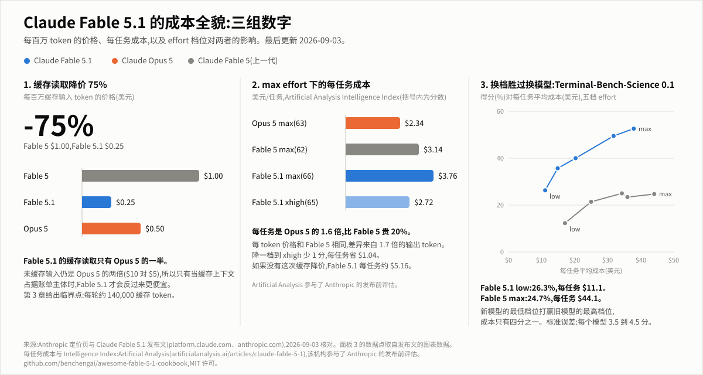
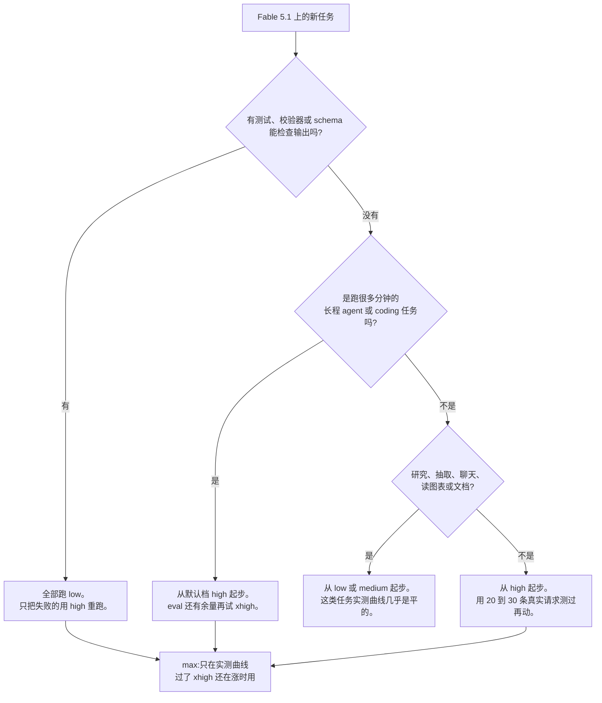

[](CHANGELOG.md)
[](LICENSE)
[](CHANGELOG.md)
[](README.md)

# Awesome Fable 5.1 Cookbook

Fable 5.1 每 token 贵一倍,每任务贵 1.6 倍。这本手册讲它什么时候仍然值得,以及怎么把账单砍下来。

[English README](README.md)



**怎么用这本手册**

- 只想要结论:看下面的五条规则,再看第 3 章末尾的决策矩阵。
- 想算自己的账:跑 `examples/cost_calculator.py`,把你的 token 数填进去。
- 想核对来源:每个数字都有出处,全部在 [`data/facts.json`](data/facts.json) 里。

数字分四个等级:**official** 是 Anthropic 定价页或文档上的原文;**measured** 是 Anthropic 或具名第三方公布的实测;**derived** 是用前两种算出来的,附算式;**estimate** 是没有来源的估计,会写明假设。表格里的"来源"列和每节末尾的来源行标的就是这个。价格都是美元/百万 token(MTok),2026-09-03 核对。手册持续更新,新模型和新价格出来就跟进,记录在 [CHANGELOG](CHANGELOG.md)。

**先解释几个词**

| 词 | 意思 |
|---|---|
| token | 计费单位。英文大约四个字母一个 token,中文大约一到两个字一个。 |
| 输入 / 输出 | 你发给模型的内容按输入计费;模型写出来的内容(包括它内部的思考)按输出计费。Fable 5.1 的输出单价是输入的 5 倍。 |
| prompt 缓存 | 多轮对话每一轮都要把前面的内容重发一遍。缓存就是让模型记住已经处理过的部分,重发时按"缓存读取"的低价收费。第一次存进去叫"缓存写入",比普通输入贵 25%。 |
| effort | 一个请求参数,决定模型花多少 token 去思考和干活。五档,从 `low` 到 `max`,越高越贵。 |
| 每个解决任务的成本 | 总花费除以做对的任务数。做错的任务照样收费,所以便宜但常错的设置,按这个算不一定便宜。 |
| 临界点 | 两个模型每轮花费相等的那一点。过了这一点,原本贵的那个反而便宜。 |

## 目录

- [TL;DR:五条规则](#tldr五条规则)
- [参数速查](#参数速查)
- [1. 五档 effort 怎么选](#1-五档-effort-怎么选)
- [2. 缓存降价 75% 后的 prompt 组织](#2-缓存降价-75-后的-prompt-组织)
- [3. Fable 5.1 还是 Opus 5:临界点在哪](#3-fable-51-还是-opus-5临界点在哪)
- [4. 1M 上下文的实际用法](#4-1m-上下文的实际用法)(v0.2)
- [5. 从 Fable 5 迁移](#5-从-fable-5-迁移)(v0.2)
- [6. 常见浪费模式 checklist](#6-常见浪费模式-checklist)(v0.2)
- [更新策略与贡献](#更新策略与贡献)

## TL;DR:五条规则

1. **agent loop 从 `low` 起步,别用默认档。** Anthropic 在 SWE-bench Pro 上测过:Fable 5.1 用 `low` 解决 88.6% 的任务,每个解决任务 $0.54;默认档 `high` 解决 92.1%,每个 $1.19。哪里不够再往上调。
2. **重复的内容全部缓存,然后看命中率。** Fable 5.1 缓存读取 $0.25 每 MTok,不缓存 $10。缓存让 Anthropic 的 agent loop 成本降到原来的 1/2.7 到 1/5.3。生产环境里正常的 loop 有 84% 的输入走缓存,低于 80% 就是哪里在破坏缓存。
3. **只有缓存占大头时,Fable 5.1 才比 Opus 5 便宜。** 每轮 2,000 个新输入加 1,000 个输出 token 时,两个模型在每轮 140,000 个缓存 token 处打平。不到这个数,Opus 5 便宜;到 600,000,Fable 5.1 便宜 34%。
4. **新模型的低档能打赢旧模型的最高档。** Terminal-Bench-Science 上,Fable 5.1 的 `low` 得 26.3%,每任务 $11.1;Fable 5 的 `max` 得 24.7%,每任务 $44.1。`max` 只在实测曲线过了 `xhigh` 还在涨时才用。
5. **别靠压低 `max_tokens` 省钱。** 上限设成 16,384 时,Fable 5.1 有 43% 的尝试被截断,每个解决任务的成本一分没省(16K 是 $21,64K 是 $22)。省钱靠 `effort` 和 task budget,这两个模型看得见。

来源:第 1、5 条是 Anthropic 成本指南的实测;第 2 条是官方定价加实测;第 3 条按官方定价推算;第 4 条是发布文的图表数据。

## 参数速查

| 项目 | Claude Fable 5.1 | 来源 |
|---|---|---|
| API 模型 ID | `claude-fable-5-1` | official |
| 发布日期 | 2026-09-01 | official |
| 价格,输入 / 输出 | $10 / $50 每 MTok | official |
| 价格,缓存写入 5 分钟 / 1 小时 | $12.50 / $20 每 MTok | official |
| 价格,缓存读取 | $0.25 每 MTok(输入价的 0.025 倍;其他模型都是 0.1 倍) | official |
| 价格,Batch API | $5 / $25 每 MTok,所有 token 半价,含缓存读写 | official |
| 上下文窗口 | 1M token,默认即最大,无长上下文加价 | official |
| 最大输出 | 128K token(超过 16K 要用 streaming) | official |
| effort 档位 | `low`、`medium`、`high`(默认)、`xhigh`、`max` | official |
| Thinking | 自适应,常驻。`thinking.type: "disabled"` 和 `budget_tokens` 都返回 400 | official |
| 可靠知识截止 | 2026 年 6 月 | official |
| 最小可缓存前缀 | 512 token | official |
| 退役 | 不早于 2027-09-01 | official |
| 数据保留 | 要求 30 天保留;零保留(ZDR)组织收到 400 | official |
| Intelligence Index 每任务成本,`max` | $3.76(Opus 5 $2.34;Fable 5 $3.14) | measured,Artificial Analysis |
| 发布 benchmark,Fable 5 到 5.1,`max` | Terminal-Bench-Science 24.7% 到 52.6%;Terminal-Bench 4.0 42.0% 到 55.8%;CursorBench 70.5% 到 73.4%;GDPval-AA 1723 到 1853 Elo | measured,Anthropic 发布文 |

## 1. 五档 effort 怎么选

effort 决定模型每次回答花多少 token 思考和行动。它是你手里最直接的省钱开关:Artificial Analysis 跑同一套题,Fable 5.1 在 `low` 下总共输出 13.1M token,在 `max` 下输出 143.7M,差 11 倍。

### 1.1 每一档是干什么的

effort 管的是全部输出:正文、tool call、思考。档位越低,tool call 也越少越短。`high` 是默认值,不传参数就是它。

| 档位 | Anthropic 的定义 | 注意 |
|---|---|---|
| `low` | 需要最快速度和最低成本的简单任务,例如 subagent | Fable 5.1 在 `low` 下更爱凭记忆作答,搜索工具调得少;需要新数据的轮次加一句"先查再答" |
| `medium` | 需要平衡速度、成本和效果的 agentic 任务 | eval 证明质量守得住之后的降本档 |
| `high` | 复杂推理、难 coding、agentic 任务。默认值 | `max_tokens` 要设大,它同时限制思考和正文 |
| `xhigh` | 30 分钟以上、token 预算百万级的长 agentic 和 coding 任务 | token 用量明显高于 `high` |
| `max` | 最深推理,不限制 token 消耗 | 大多数任务上多花的钱换不来多少分;结构化任务上可能想太多 |

来源:Anthropic effort 文档(official)。

### 1.2 每一档的实测成本

发布文里有一张图,画了四个 benchmark 上每一档的成本和得分。下面的数字是从那张图的数据里读出来的。

| effort | Terminal-Bench-Science 0.1 | Terminal-Bench 4.0 | CursorBench 3.2.0 | Humanity's Last Exam,带工具 |
|---|---|---|---|---|
| `low` | 26.3%,$11.1 | 40.2%,$5.7 | 66.2,$2.90 | 60.0,$0.52 |
| `medium` | 35.7%,$14.9 | 43.4%,$7.8 | 68.0,$3.53 | 63.0,$0.67 |
| `high` | 40.0%,$20.3 | 49.4%,$10.5 | 69.4,$4.80 | 64.8,$1.05 |
| `xhigh` | 49.5%,$31.8 | 51.3%,$15.8 | 72.8,$6.96 | 65.1,$2.28 |
| `max` | 52.6%,$37.9 | 55.8%,$19.5 | 73.4,$9.64 | 65.0,$3.20 |

看这张表要注意三点:

- 从 `low` 到 `max`,钱大约翻 3 到 3.5 倍,Humanity's Last Exam 翻 6 倍。
- 买到的分数差别很大。Terminal-Bench-Science 多 26 分,Terminal-Bench 4.0 多 16 分,CursorBench 只多 7 分,Humanity's Last Exam 只多 5 分,而且它到 `high` 就不涨了,`max` 反而比 `xhigh` 低 0.1 分,还贵 40%。
- Terminal-Bench-Science 每个模型的误差有 3.5 到 4.5 分。相邻两档的差距多半在误差里,`low` 到 `max` 的差距不在。

Anthropic 成本指南上的实测也是这个形状。DeepResearch Bench II 上,Fable 5.1 的 `low`、`medium`、`high` 得分差不多,每任务成本却从 $4.66 涨到 $7.12。Fable 5 在四个 research benchmark 上,`low` 少 1 到 3 分,省三分之一到一半;`medium` 分数和默认档一样,只花 70% 到 87% 的钱。例外是长程 coding:SWE-bench Pro 上 Opus 5 用 `medium` 少 2 分省一半,用 `low` 少 8 分省四分之三。这类任务上,effort 是真的在买分数。

来源:发布文图表数据,Anthropic 成本指南(measured);倍数为推算。

### 1.3 决策树



### 1.4 场景对照表

| 场景 | 起步档位 | 依据 |
|---|---|---|
| subagent 做限定范围的查找或批量读取 | `low` | Anthropic 把 subagent 列为 `low` 的用例;低档位的 tool call 更少更短 |
| 分类、抽取、带 schema 的打标 | `low`,配 `strict: true` 的工具或 structured outputs | 研究和知识工作的曲线几乎是平的:`low` 省三分之一到一半,只少 1 到 3 分(Fable 5 实测) |
| 延迟敏感的聊天 | `low` | DeepWideSearch 上 `low` 每题 4.5 分钟,默认档 7.9 分钟(Fable 5 实测) |
| 读图表或文档 | `low` | Chartography:Fable 5.1 `low` 得 62.5,每图 $0.15;Opus 5 `low` 得 49,每图 $0.38 |
| 深度研究报告 | `low` | DeepResearch Bench II:`low` 66% 花 $4.66,`high` 65% 花 $7.12 |
| 有测试能判分的 coding | `low`,失败的用 `high` 重跑 | Opus 5 在 SWE-bench Pro 上:约 93% 通过,每任务约 $0.45;全程默认档 91.7%,$0.93 |
| 没有自动检查的 coding | `high` | SWE-bench Pro:Fable 5.1 默认档 92.1% 花 $1.19,`low` 88.6% 花 $0.54;那 3.5 分要花 2.2 倍的钱 |
| 30 分钟以上的长 agent loop | `high`,eval 有余量再 `xhigh` | Terminal-Bench 4.0:`high` 49.4% 花 $10.5,`xhigh` 51.3% 花 $15.8,`max` 55.8% 花 $19.5 |
| 每一分都要的 agentic 科研 | `xhigh` 或 `max` | Terminal-Bench-Science:`xhigh` 49.5% 花 $31.8,`max` 52.6% 花 $37.9,多 3.1 分贵 19% |
| 跨 session 的多文件重构或迁移 | `high` | Anthropic 说明 Fable 5 到 5.1 的提升集中在长程 agentic coding,档位越高差距越大 |
| eval 评审或打分 | `low` 或 `medium` | 输出结构化、可检查;上面的研究曲线适用 |
| 任何要跑 10,000 次的 prompt | 先做 sweep | Anthropic 的做法:20 到 30 条真实请求,每次只换一档,成本和分数并排记 |

来源:依据列里的数字都是 Anthropic 成本指南和发布文的实测,前两行和第 10、12 行的说法来自官方文档。

### 1.5 反直觉的结果:新模型的 `low` 打赢旧模型的 `max`

Terminal-Bench-Science 上,Fable 5.1 用 `low` 得 26.3%,每任务 $11.1;Fable 5 用 `max` 得 24.7%,每任务 $44.1。分数差 1.6 分,在误差里;钱差四倍,不在。

往下一级也一样。Opus 5 的 `low` 在 SWE-bench Pro 上打赢 Opus 4.8 的默认档,每个解决任务只花它 30% 的钱。Fable 5.1 和 Fable 5 在 SWE-bench Pro 上分数一样,每个解决任务便宜 43%,省的主要是缓存读取。所以最便宜的升级路线一般是:换新模型,调低档位。

但这不是定律。DeepResearch Bench II 上,从 Fable 5 换到 5.1,`high` 下每任务贵 41%,`low` 下贵 79%,只多 2 到 3 分,因为新模型在这类任务上跑得更久、读得更多。升级前在自己的任务上量一下。

来源:发布文图表数据,Anthropic 成本指南(measured);11.1 / 44.1 = 0.25 为推算。

### 1.6 先跑 `low`,失败的用 `high` 重跑

只要任务的结果能自动检查,最省钱的做法就不是固定一档。Anthropic 用 Opus 5 在 SWE-bench Pro 上逐题算过:

| 策略 | 通过率 | 每任务成本 |
|---|---|---|
| 全程默认档(`high`) | 91.7% | $0.93 |
| 全程 `low`,失败的用默认档重跑 | 约 93% | 约 $0.45 |
| 全程 `medium`,失败的用默认档重跑 | 约 94% | 约 $0.61 |

$0.45 已经包含了失败那次的花费。这个办法是用来省钱的,不是用来提分的:把默认档自己的失败再跑一遍默认档,分数差不多,钱更多。另外要算上检查器的成本,以及首轮失败的那 16% 任务要跑两遍的时间。

来源:Anthropic 成本指南(measured)。

### 1.7 在一段对话中途改 effort

两次请求之间改顶层 `effort`,会让 prompt 缓存从那一点起失效。Fable 5.1 还会因为前面的回复是在旧档位下写的,不太听新档位的。Anthropic 在 triage agent 上量过代价:没改过的 session 花 $0.81;中途改一次 effort 又加一个工具的 session 花 $0.95,因为这两处改动重写了 39,000 和 60,000 个缓存 token。

Fable 5.1 和 Opus 5 支持逐消息改 effort,缓存不失效。做法是加一条 `system` 消息,内容为空,带上新档位,从下一个 user 轮次起生效。需要 beta header `mid-conversation-output-config-2026-07-01`,Fable 5 不支持,会返回 400。

```python
import anthropic

client = anthropic.Anthropic()

response = client.beta.messages.create(
    model="claude-fable-5-1",
    max_tokens=16000,
    output_config={"effort": "high"},
    messages=[
        {"role": "user", "content": "分三步规划这次迁移。"},
        {"role": "assistant", "content": "1. 导出。2. 建 schema。3. 导入并核对行数。"},
        # 只带 effort 的 system 消息:从下一个 user 轮次起生效,缓存保持有效。
        {"role": "system", "content": [], "output_config": {"effort": "low"}},
        {"role": "user", "content": "把方案总结成一句话。"},
    ],
    betas=["mid-conversation-output-config-2026-07-01"],
)
```

来源:Anthropic effort 文档(official),成本指南(measured)。

### 1.8 三个不是 effort 的旋钮

- **`max_tokens` 是模型看不见的安全上限。** 上限设 16,384 时,Opus 5 有 15% 的尝试被截断,Fable 5.1 有 43%;被截断的 117 次 Fable 尝试只有 9 次仍然通过。每个解决任务的成本和 64,000 时差不多,$21 对 $22,因为被截断的任务几乎都做不成。64,000 时 Fable 5.1 解决 58.5%,16,384 时只有 36.3%;128,000 时 60.0%。所以 agentic 任务设 64,000,`xhigh` 和 `max` 设 128,000,用 streaming,把 `stop_reason: "max_tokens"` 当作失败。
- **task budget 才是能省钱的预算。** 模型看得见倒计时,会自己节省。SWE-bench Pro 上 Fable 5.1 用宽松预算每任务省 44%,通过率少约 3 分;最紧的预算省 58%,少 6 分。beta header `task-budgets-2026-03-13`,下限 20,000 token,首次请求设一次就好。
- **要你会读的那种答案。** triage agent 上,一行式答案每次 $0.49,两行式 $0.57,备忘录式 $1.40,输出 token 是六倍。三种格式的正确率都在 78% 到 85%,没有差别。

来源:Anthropic 成本指南(measured)。

## 2. 缓存降价 75% 后的 prompt 组织

agent loop 的账单里,最大的一项通常是缓存读取:正常的 loop 有 84% 的输入来自缓存。Fable 5.1 把这项的单价从 $1.00 降到 $0.25。这章讲怎么把这 84% 拿到手,以及别让它悄悄掉回零。

### 2.1 相关价格

| 操作 | Fable 5.1 | Fable 5 | Opus 5 | 相对基础输入价的倍率 |
|---|---|---|---|---|
| 未缓存输入 | $10.00 | $10.00 | $5.00 | 1 倍 |
| 缓存写入,5 分钟 TTL | $12.50 | $12.50 | $6.25 | 1.25 倍 |
| 缓存写入,1 小时 TTL | $20.00 | $20.00 | $10.00 | 2 倍 |
| 缓存读取(命中或刷新) | $0.25 | $1.00 | $0.50 | Fable 5.1 为 0.025 倍,其他 0.1 倍 |
| 输出 | $50.00 | $50.00 | $25.00 | |
| Batch API | 以上每一行半价,含缓存读写 | 同 | 同 | |

来源:Anthropic 定价页(official)。TTL 是缓存的有效期。

### 2.2 降价改变了什么

- **存一次读一次就回本。** 存进 5 分钟缓存花 1.25 倍,读一次花 0.025 倍,合计 1.275 倍;不缓存发两次是 2 倍。1 小时缓存存一次 2 倍,读两次才回本。
- **整张账单跟着动。** Fable 5.1 在 SWE-bench Pro 上和 Fable 5 分数一样,每个解决任务便宜 43%,大头就是缓存读取。Anthropic 的发布图以 Fable 5 为 100,典型任务 Fable 5.1 是 75,高度 agentic 的任务是 55。Artificial Analysis 算出每个 Intelligence Index 任务省约 $1.40,从约 $5.16 降到 $3.76。
- **老账单里缓存读取占大头。** 把发布图倒过来算,Fable 5 时代缓存读取约占典型任务成本的 44%,高度 agentic 任务的 68%。
- **没命中变得更痛。** 现在一个不缓存的 token 抵 40 个缓存 token,以前是 10 个。2.6 节里每一种破坏缓存的方式,伤害都是以前的四倍。

来源:定价页(official),成本指南和发布文(measured),AA(measured);回本和倍数为推算。

### 2.3 一个算例

`examples/cost_calculator.py` 给一个每轮重发全部历史的 loop 算账:20,000 token 的前缀(system prompt、工具、参考资料),40 轮,每轮 2,000 个新输入 token(工具结果)和 1,000 个输出 token。整个过程发送 3,220,000 个输入 token。

| 模型 | 缓存 | 未缓存输入 | 缓存写入 | 缓存读取 | 输出 | 合计 |
|---|---|---|---|---|---|---|
| Fable 5.1 | 无 | $32.20 | | | $2.00 | $34.20 |
| Fable 5.1 | 有 | | $1.74 | $0.77 | $2.00 | $4.51 |
| Opus 5 | 无 | $16.10 | | | $1.00 | $17.10 |
| Opus 5 | 有 | | $0.87 | $1.54 | $1.00 | $3.41 |
| Sonnet 5 | 无 | $6.44 | | | $0.40 | $6.84 |
| Sonnet 5 | 有 | | $0.35 | $0.62 | $0.40 | $1.36 |

两点值得看。一是缓存把这个 loop 在 Fable 5.1 上降到了 1/7.6;Anthropic 在真实 benchmark 上量到的是 1/2.7 到 1/5.3,因为真实任务的工具结果和输出更大。二是开了缓存以后,Fable 5.1 最大的一笔是输出($4.51 里的 $2.00),Opus 5 最大的一笔是缓存读取($3.41 里的 $1.54)。这就是为什么 effort 在 Fable 5.1 上更要紧,也是第 3 章里两个模型会交叉的原因。

```bash
python examples/cost_calculator.py loop --prefix 20000 --turns 40 --new-input 2000 --output 1000
```

来源:按官方定价推算,假设写在脚本里(derived)。

### 2.4 排列规则

缓存是按顺序做字节级的前缀匹配:先 `tools`,再 `system`,再 `messages`。前面任何一个字节变了,后面全部作废。

1. **稳定的放前面,会变的放后面。** 冻结的 system prompt、顺序固定的工具列表、参考文档放最前;然后是对话;最后才是每次都不同的东西,比如检索结果、用户的问题、任何带时间的字段。
2. **静态前缀末尾放一个显式断点,尾部用自动缓存。** 显式断点保证前面那块贵的东西不管后面怎么变都能读回来;顶层的 `cache_control` 字段会随对话增长自动往后挪断点。这是 agent loop 最稳的写法。
3. **记住三个硬限制。** 前缀不足 512 token 不缓存,而且不报错;每次请求最多 4 个断点;系统只从断点往回找 20 个 block,一轮追加很多 block 时要加第二个断点。
4. **多段对话共用一个前缀时,必须用显式断点。** 自动缓存只在一段对话内起作用。一队共享 system prompt 的独立任务,只有共享部分自带断点才能互相读到。

```python
import anthropic

client = anthropic.Anthropic()

with client.messages.stream(
    model="claude-fable-5-1",
    max_tokens=64000,
    output_config={"effort": "low"},
    tools=TOOLS,  # 每次请求都是同一个列表、同一个顺序
    system=[
        {"type": "text", "text": SYSTEM_PROMPT},
        {"type": "text", "text": REFERENCE_DOCS, "cache_control": {"type": "ephemeral"}},
    ],
    messages=history + [{"role": "user", "content": new_tool_result_or_question}],
    cache_control={"type": "ephemeral"},  # 跟着尾部走的自动断点
) as stream:
    response = stream.get_final_message()

u = response.usage
print(u.cache_read_input_tokens, u.cache_creation_input_tokens, u.input_tokens)
```

来源:Anthropic prompt caching 文档(official)。

### 2.5 TTL 和保活

缓存的有效期从写入或读取它的那次请求"开始"算,生成的时间也算在内。一次响应生成了 4 分钟,下一次请求就得在 1 分钟内发出,5 分钟的缓存才还在。

| 共享前缀的两次请求隔多久 | Fable 5.1 怎么选 | 原因 |
|---|---|---|
| 5 分钟以内(连续 loop) | 5 分钟 TTL | 每次请求都会刷新它。没有停顿时,5 分钟档比 1 小时档在 Sonnet 5 上便宜 15%,在 Opus 5 上便宜 11% |
| 几分钟到几十分钟(用户过一会儿再回,或一次很长的生成) | 5 分钟 TTL 加保活 | 在上一次请求开始后 4 分钟内、之后每 4 分钟,把上一次请求原样再发一遍,`max_tokens` 设 0,关掉 `stream`。只计一次便宜的缓存读取,计时重新开始。Anthropic 实测在 Fable 5.1 上,停顿以分钟计时这比 1 小时档便宜 |
| 停顿接近一小时 | 1 小时 TTL | 保活要连续做大半个小时的话,1 小时档的写入加价反而更划算 |
| 超过一小时 | 都不用。接受未命中,或者按计划预热 | |

保活的账很简单:200,000 token 的前缀,保活一次读取花 200,000 x $0.25 / 1M = $0.05;换成 1 小时档,每次写入每 MTok 多花 $7.50,这个前缀就是 $1.50。保活十五次撑满一小时,花 $0.75。保活不能和 structured outputs 一起用,也不能走 Batch API,那两种情况用 1 小时档。

来源:prompt caching 文档(official),成本指南(measured);保活算账为推算。

### 2.6 静默破坏缓存的东西

下面每一条都会让 `cache_read_input_tokens` 变成 0,而且不报错:

- system prompt 里或断点之前出现时间戳、日期、请求 ID、用户名
- 工具列表在两次请求之间变了,或者序列化顺序变了
- 渲染进前缀的 JSON 或字典没有排序
- 两次请求之间改了顶层 `effort` 或 thinking 配置(用 1.7 节的逐消息写法)
- 对话中途换模型:缓存按模型、按 workspace 隔离
- 首次请求之后改 task budget
- 每一次 context editing,都会从清除点起重写前缀
- 前缀不足 512 token
- 每次不同的内容放在静态块上面而不是下面

破坏一次要多少钱:triage agent 上,中途改一次 effort 加一个工具,session 从 $0.81 涨到 $0.95。同样的改动放在 compaction 之后的第一次请求上只花 $0.75,因为那次本来就要重写。

来源:prompt caching 文档(official),成本指南(measured)。

### 2.7 用 `usage` 验证,别靠看代码

一个健康的、已经热起来的 loop,`cache_read_input_tokens` 远高于 `input_tokens`,`cache_creation_input_tokens` 大约是一轮的量,不是整段对话的量。生产环境正常的 loop 有 84% 的输入走缓存,最好的 10% 到 94% 以上,低于 80% 就去找破坏点。最便宜的检查是探针:同一条有代表性的请求原样发两次,第二次的 `cache_read_input_tokens` 还是 0 就让构建失败。

来源:成本指南(measured)。

### 2.8 Batch 和缓存叠加

Batch API 让每个 token 都半价,含缓存读写。Fable 5.1 走 batch 时缓存读取每 MTok $0.125,输入 $5,输出 $25。结果在 24 小时内返回,请求是一次性的,所以适合 eval、回填和定时任务,不适合有人在等的场景。DeepResearch Bench II 上光靠缓存就把 Fable 5.1 从每任务 $37.94 降到 $7.12;离线跑再叠 batch,还能减半。

来源:定价页(official),成本指南(measured);$0.125 为推算。

## 3. Fable 5.1 还是 Opus 5:临界点在哪

选模型是账单上最大的一笔。Anthropic 自己的文档给了两个方向,价格表能解释为什么两个都对。

### 3.1 两个官方立场

- 模型总览页:大多数任务从 Claude Opus 5 起步;Fable 5.1 留给高要求推理和长程 agentic 工作,或者 Opus 5 调高 effort 之后 eval 仍不达标的时候。
- 成本指南:"对大多数 agent 工作负载,从 Claude Fable 5.1 的 `low` 起步,哪里不够再往上调。每 token 它的未缓存输入是 Claude Opus 5 的两倍,缓存输入却只有一半($0.25 对 $0.50 每百万),而 agent loop 里缓存输入是最大的一项。"

第一条讲能力,什么任务都适用。第二条讲一种特定的账单形状:每轮都要重读一大段缓存前缀的 loop。3.3 节给出把两者分开的那个数。

来源:Anthropic 模型总览页、成本指南(official)。

### 3.2 价格表

| 每 MTok | Fable 5.1 | Opus 5 | Fable 5.1 / Opus 5 |
|---|---|---|---|
| 输入,未缓存 | $10.00 | $5.00 | 2 倍 |
| 输出 | $50.00 | $25.00 | 2 倍 |
| 缓存写入,5 分钟 | $12.50 | $6.25 | 2 倍 |
| 缓存写入,1 小时 | $20.00 | $10.00 | 2 倍 |
| 缓存读取 | $0.25 | $0.50 | 0.5 倍 |
| Batch 输入 / 输出 | $5 / $25 | $2.50 / $12.50 | 2 倍 |

来源:Anthropic 定价页(official)。

### 3.3 缓存读取的价格倒挂

价格表里只有一行是 Fable 5.1 便宜的:缓存读取。而长 loop 里最多的 token 恰恰是缓存读取。所以缓存越大,Fable 5.1 就从贵变便宜。

每轮在 C 个缓存 token 之上加 2,000 个新输入和 1,000 个输出(C 以百万计),按标价算:

- Fable 5.1:0.25 x C + 2,000 x $10 / 1M + 1,000 x $50 / 1M = 0.25C + $0.070
- Opus 5:0.50 x C + 2,000 x $5 / 1M + 1,000 x $25 / 1M = 0.50C + $0.035
- 两边相等时 C = 0.035 / 0.25 = 0.14M,也就是**每轮约 140,000 个缓存 token**

| 每轮缓存 token | Fable 5.1 每轮 | Opus 5 每轮 | Fable 5.1 相对 Opus 5 |
|---|---|---|---|
| 0 | $0.070 | $0.035 | +100% |
| 50,000 | $0.083 | $0.060 | +38% |
| 100,000 | $0.095 | $0.085 | +12% |
| 140,000 | $0.105 | $0.105 | 0% |
| 200,000 | $0.120 | $0.135 | -11% |
| 300,000 | $0.145 | $0.185 | -22% |
| 600,000 | $0.220 | $0.335 | -34% |
| 1,000,000 | $0.320 | $0.535 | -40% |

这个算法有三个假设,都偏向 Fable 5.1:每个缓存 token 都命中;新加的内容按普通输入计费,没有写进缓存;两个模型输出一样多。把新内容写进 5 分钟缓存,临界点变成约 175,000。而且 Fable 5.1 每个任务往往干得更多:Intelligence Index 上它的输出 token 是 Fable 5 的 1.7 倍,DeepResearch Bench II 上它的默认档比 Opus 5 的默认档更贵、分更低。所以把 140,000 当成"Fable 5.1 有可能更便宜"的起点,不是保证。

临界点这个思路来自 Digital Applied 的测算,这里的算术按 Anthropic 标价重算了一遍,脚本里有。

```bash
python examples/cost_calculator.py breakeven --new-input 2000 --output 1000
```

来源:按官方定价推算(derived);输出倍数和 DeepResearch 数字来自 AA 和成本指南(measured)。

### 3.4 每任务成本,整套平均

Artificial Analysis 跑完整套 Intelligence Index,按任务算平均成本。注意:Artificial Analysis 参与了 Anthropic 对这个模型的发布前评估。

| 模型和 effort | Intelligence Index | 每任务成本 |
|---|---|---|
| Opus 5,`max` | 63 | $2.34 |
| Fable 5,`max` | 62 | $3.14 |
| Fable 5.1,`xhigh` | 65 | $2.72 |
| Fable 5.1,`max` | 66 | $3.76 |

Fable 5.1 的 `max` 是 Opus 5 的 1.6 倍(3.76 / 2.34 = 1.61),比 Fable 5 贵 20%(3.76 / 3.14 = 1.20)。每 token 价格和 Fable 5 一样,贵在输出 token 是 1.7 倍。降一档到 `xhigh`,少 1 个指数点,每任务省 $1.04。有些二手来源写的是 $3.69 和"比 Opus 5 贵 57%",本手册用 Artificial Analysis 原文的 $3.76。

来源:Artificial Analysis(measured);倍数为推算。

### 3.5 每个解决任务的成本,逐个 benchmark

价目表按 token 收费,你付的是做完的任务。Anthropic 按客户实际计费的方式给自己的实验算了账:

| Benchmark | Fable 5.1 | Opus 5 | 按结果算谁便宜 |
|---|---|---|---|
| SWE-bench Pro 子集,每个解决任务 | `low` 88.6% 花 $0.54;默认档 92.1% 花 $1.19 | `low` 84.0% 花 $0.25;默认档 91.7% 花 $1.01 | 冲最高分:Opus 5 默认档便宜 15%。要 88% 就够:Fable 5.1 的 `low` |
| 内部 agentic coding benchmark,每次尝试 | `medium` $2.91 | 默认档 $8.50,分数相同 | Fable 5.1 的 `medium`,约三分之一的钱 |
| DeepResearch Bench II,每任务 | `low` 66% 花 $4.66;默认档 65% 花 $7.12 | 默认档 71% 花 $6.71 | 冲最高分:Opus 5 默认档。Fable 5.1 只在 `low` 下划算 |
| Chartography,每图 | `low` 62.5 花 $0.15 | `low` 49 花 $0.38 | Fable 5.1,分更高,钱只要 40% |
| Terminal-Bench-Science,每任务 | `low` 26.3% 花 $11.1;`max` 52.6% 花 $37.9 | 未公布 | 只能和 Fable 5 比 |

表背后的公式:每次成功的成本 = 每次尝试的成本 / 通过率。它对"便宜但常错"的设置很不客气,因为做错的那次照样收费,重做还要再付一次,失败本身还有后续代价。另外要盯长尾,不是中位数:20 道 WideSearch 题里,最贵的两道占了 43% 的花费,最便宜的一半只占 10%。

来源:Anthropic 成本指南(measured)。

### 3.6 决策矩阵

| 工作负载 | 选 | 数字 |
|---|---|---|
| 共享上下文很少的请求,不论量多大 | Opus 5 | 每轮缓存 token 不到 140,000 时 Opus 5 便宜,零缓存时便宜到一半 |
| 有测试的 coding agent | Fable 5.1 的 `low`,或 Opus 5 的 `low` 加失败重跑 `high` | Fable 5.1 `low` 88.6% 花 $0.54;Opus 5 重跑策略约 93% 花约 $0.45 |
| 没有测试、必须冲最高分的 coding agent | Opus 5 默认档 | 91.7% 花 $1.01,对 Fable 5.1 的 92.1% 花 $1.19,分数差在噪声内 |
| 在一大段固定上下文上跑的长 loop(每轮 200,000 缓存 token 以上) | Fable 5.1,从 `low` 起步 | 每轮 300,000 缓存 token 时 Fable 5.1 便宜 22%,600,000 时便宜 34%;也是成本指南自己的建议 |
| 深度研究报告 | Opus 5 默认档;预算更紧就 Fable 5.1 的 `low` | 71% 花 $6.71,对 66% 花 $4.66 |
| 读图表和文档 | Fable 5.1 的 `low` | 62.5 花 $0.15,对 Opus 5 的 49 花 $0.38 |
| Opus 5 在 `xhigh` 或 `max` 下仍不达标的工作 | Fable 5.1 的 `xhigh` 或 `max` | 官方的升级条件;Intelligence Index 66 对 63 |
| 有检查器的高频简单任务 | Haiku 4.5 或 Sonnet 5 | Haiku 4.5 答 GPQA Diamond 每题成本约是 Opus 5 的十分之一,63% 对 92% |

来源:第 1、4 行按官方定价推算;其余是成本指南和 AA 的实测。

### 3.7 订阅用户

Claude Pro 用户使用 Fable 5.1 需要额外付费;Opus 5 是订阅内包含的最强模型。这条目前是 estimate:维护者报告,来源链接待补,补上后重新定级。

### 3.8 会改变结论的因素

- **重试和人工复核。** 如果一次失败要人来看,先把复核成本加进每次尝试的成本,再除以通过率。每次尝试 $1 时,4 个百分点的通过率差距值 $0.18;复核一次 $5 时就远不止了。
- **拒答和回退。** Fable 5.1 带安全分类器,可能返回 `stop_reason: "refusal"`。服务端回退会在 Opus 5 或 Opus 4.8 上重试,fallback credit 退还换模型的缓存费用。经常触发拒答的任务在为两个模型付钱。
- **限流和层级。** Fable 5.1 和 Fable 5 共用限流池,没有 Priority Tier。fast mode 只有 Opus 5 和 Opus 4.8 有,$10 / $50。
- **数据保留。** Fable 5.1 要求 30 天保留;零保留组织每次请求都收到 400。
- **仅美国推理。** 两个模型都要每个 token 乘 1.1。

来源:Anthropic 定价页与 Fable 5.1 文档(official);复核算例为推算。

## 4. 1M 上下文的实际用法

计划在 v0.2 发布(目标 2026-09-05)。先记两个数:1M 窗口没有长上下文加价;把它塞满一次,不缓存 $10.00,写进 5 分钟缓存 $12.50,从缓存读 $0.25。

## 5. 从 Fable 5 迁移

计划在 v0.2 发布(目标 2026-09-06)。三个 breaking change 已经在 [`data/facts.json`](data/facts.json) 里:forced `tool_choice` 返回 400;thinking block 绑定生成它的模型;2026-08-31 及之后创建的账号,编辑历史会让 thinking block 失效。

## 6. 常见浪费模式 checklist

计划在 v0.2 发布(目标 2026-09-07)。每一条都会带实测成本,以及能暴露它的 `usage` 字段。

## 更新策略与贡献

- Anthropic 新模型发布和定价变化会跟进收录。先改 `data/facts.json`,再改两份 README 和信息图,最后改 [CHANGELOG](CHANGELOG.md) 和 badge 日期。
- 贡献的数字必须带来源 URL、核对日期和等级。三者缺一不合并。
- 来源之间的分歧记录在 `data/facts.json` 的 `discrepancies` 下,写明采用哪个值和理由。
- 过时的建议标日期,不删除。

## 来源

- Anthropic 定价:https://platform.claude.com/docs/en/about-claude/pricing
- Anthropic 模型总览:https://platform.claude.com/docs/en/about-claude/models/overview
- Claude Fable 5.1 模型页与 what's new:https://platform.claude.com/docs/en/models/fable-5-1/overview
- Effort:https://platform.claude.com/docs/en/build-with-claude/effort
- Prompt caching:https://platform.claude.com/docs/en/build-with-claude/prompt-caching
- Optimizing for cost and intelligence(上文所有 Anthropic 实测):https://platform.claude.com/docs/en/about-claude/models/optimizing-for-cost-and-intelligence
- 发布文,含各档 effort 的图表数据:https://www.anthropic.com/claude-fable-and-mythos-5-1
- Artificial Analysis:https://artificialanalysis.ai/articles/claude-fable-5-1

## 许可

MIT,版权 2026 Ben Cheng。见 [LICENSE](LICENSE)。
